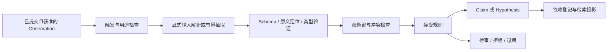
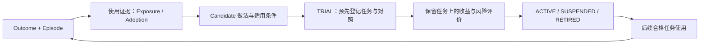

# 认知算法与流水线详设

状态：architecture-1 目标。业务不变量见[领域模型](domain-model.md)，学习晋升数值和效果评价见[学习合同](learning-and-evaluation.md)。本文定义执行步骤与输入输出，不把未来模型质量当作已证明结果。

## 1. 五类材料的用途

| 材料 | 回答的问题 | 典型输入 | 主要消费者 |
|---|---|---|---|
| Evidence / Observation | 实际说过/看到/执行了什么 | 用户原话、工具返回、获准材料、回执 | 接受规则、Verifier、解释 |
| Episode | 一次尝试怎样发生、结果如何 | 目标快照、行动、Outcome、未决项 | 继续任务、学习、相似任务参考 |
| Claim / Hypothesis | 当前知道什么、哪里待证 | 有依据命题、反证、有效时间 | 上下文、问答、验证计划 |
| WorkingState / Goal / Commitment | 现在在做什么、还欠什么 | 用户目标、步骤、约束、期限、状态 | Coordinator、Scheduler、Attention |
| Procedure | 在什么条件下怎样做更有效 | 多次采用/结果/对照与失败边界 | 计划建议、执行检查、学习评价 |

这些是角色分工，不是按层数自动提升的可信度阶梯。一个高级摘要仍可能不可靠，一条用户直接偏好也无需经过多轮“升层”才能使用。所有材料都携带来源、scope/privacy、版本、有效性和失效依赖。

## 2. 从证据到候选



### 抽取输入

ExtractorInput：executionUnitId、sourceObservationRefs、获准 source fragments、当前 scope、已知实体/任务标识、allowedKinds、policyRevision、extractorRevision、输出预算。source fragments 与其不可变选择器一一对应；模型不自己请求任意原始资料集合。

首版单次归纳最多 16 个候选，每个命题最多 2048 个 Unicode 字符，必须引用给定证据编号并给出精确原文；超限/非法不部分接受。长期目标、人物身份、权限、有效期不能从不明确的语句自行补成确定值。

```typescript
type CandidateProposal = Readonly<{
  kind: "fact" | "preference" | "constraint" | "decision";
  subjectRef: KnownSubjectRef | {kind: "unresolved"; textRef: string};
  predicate: string;
  value: TypedValue;
  evidence: readonly {observationId: string; fragmentId: string;
    quotedText: string}[];
  validFrom?: string;
  validUntil?: string;
  confidence: number; // [0,1] 的抽取自评，不是真值概率或接受许可
}>;
```

服务端把 quotedText 与指定 fragment 精确匹配并计算 UTF-8 字节区间，不要求模型数偏移。重复文本不能唯一定位时保留待审，不能任意选一处。边界验证字段、枚举、数值/时间、区间/编码边界和原文支持；缺证据、范围不符、引用不存在或自评越界即拒绝。合法 confidence 也不能代替来源或独立验证。

“引文存在”不等于“模型命题被引文蕴含”。自动接受的 attributed asserted 以原话为事实内容，模型标签只作派生检索提示；结构化命题值只有通过固定类型/字段/语义规则或明确用户确认才进入约束区。无法证明的模型改写保留 Candidate/Hypothesis，避免把“我不喜欢茶”反转成“喜欢茶”。显式记住的确定性路径不必调用模型，来源准确性与世界事实正确性仍分开。

### 命题与实体

比较键由 scope、已知 subjectRef、predicate、限定条件与有效区间形成。subjectRef 优先使用已经存在的 Workspace/Goal/Artifact/获准外部资源身份；显示名称不当实体主键。没有足够身份依据时保持 unresolved Candidate/Hypothesis，不因同名合并不同人或资源。

文本规范化只服务比较/搜索，不改变原证据。数值必须保留单位，时间必须保留解释所用时区；“预算 8 万”不能在缺币种/对象时扩写为任意全局约束。显式纠正使用目标 Claim Ref，避免用模糊文本选择被替换的历史。

### 接受决定

复用[候选接受表](learning-and-evaluation.md#候选接受规则)：明确用户指令可形成 asserted；自动对话记忆需已开启的 Workspace 策略且无冲突；工具结构化字段需独立验证器；推断/偏好改变/跨域推广保持待证。

接受前再次读证据资格；T02 同时写 ClaimVersion、证据边、生命周期、依赖和 Outbox。模型返回“已保存”不是提交事实。自动抽取失败记录固定原因，当前任务的真实结果不被回滚或伪装为学习成功。

## 3. 冲突、纠正与时间

| 情况 | 判定 | 操作 |
|---|---|---|
| 相同命题/值/适用时间重复出现 | 新证据，不是新独立事实 | 去重并保留证据来源；不同来源是否独立明确记录 |
| 同一对象属性在不同有效区间变化 | 时间演进 | 新版本，历史查询按区间解释 |
| 同一区间出现互斥值 | 冲突 | DISPUTED/待验证，保留双方，不按写入时间选真 |
| 用户明确纠正某 Claim | 意图明确 | 新版本 + 原子 supersede，传播失效 |
| 外部资料与用户陈述不一致 | 来源/真值区别 | 保留 attributed assertion 与反证，不能伪装已验证一致 |
| 证据失效/过期/遗忘 | 支持条件丢失 | 停止当前使用，必要时重新取得获准证据 |

validAt 决定“哪时成立”，knownAt 决定“当时系统知道什么”。普通任务默认使用现在有效、现在已知的材料；历史查询带明确标签，不把历史事实放进当前约束区。

## 4. 检索与资格

RetrievalInput：当前请求/目标/WorkingState、允许 ScopeSelector、用途/受众（UI、确定性规则、模型）、时间参数、kinds、limit、预算与 epoch。检索器不接受“所有 Workspace”作为默认范围。

```text
建立一致 scoped read view
→ SQL/Core 资格筛选（scope、privacy、life、time、source-block、dependencies）
→ 分路取得固定/精确引用、结构化实体匹配、FTS候选
→ 从真源 hydrate 精确版本，再验资格
→ 去重复与冲突分组
→ 确定性排序，输出选择/排除原因
```

FTS 首版只索引受治理内容和获准 Episode/Procedure 摘要，不能默认把所有 raw 对话全文作为事实召回。候选上限默认 100 条（包括固定/精确材料），先过滤再截取；FTS 无命中明确返回空或执行有界且同资格的真源检索，不放宽访问条件。

### 排序规则

采用可解释的分层排序，不引入未经评价的复杂加权模型：

1. 用户本次显式引用/固定的必要约束；
2. 当前 Task/Goal 精确关联材料；
3. 当前 Workspace 的已确认约束/决定及当前工作状态；
4. 任务类别与前提匹配的做法、相关经历；
5. 其他获准相关认知；
6. 明确标识的假设/冲突，用来提问或验证。

同层按实体/关键词匹配、有效时间相关性、适用性、去冗余后的 FTS 相关次序；最终以稳定 ID/version 打破平局。访问次数、提取器 confidence、纯 recency 都不能把不合格内容提升进候选。FTS 分数只在当前查询候选中比较，不直接当知识真实性。

向量/混合检索只在 X2-01 有实际漏召回与配对收益后接入；结构化资格过滤和真源 hydrate 保持在外围。FTS5 的索引/排序能力依据 [SQLite FTS5 文档](https://www.sqlite.org/fts5.html)，并不证明当前中文分词效果；分词与中文召回是 P1/P2 基准的实测项目。

## 5. Context 编译算法

TokenCounter 属于已选择 ModelProfile；缺少可靠计数能力时该 profile 不获准自动逼近上限。估算模式必须声明、采用保守余量，不能把估算标为精确计费。

```text
availableInput = contextLimit - reservedOutput - mandatoryProtocolOverhead
base = safety/task/currentUserRequest/requiredWorkingState
if tokens(base) > availableInput: budget_conflict
memoryBudget = min(4096, floor(availableInput * 0.25))
memoryBudget = min(memoryBudget, availableInput - tokens(base))
requiredMemory = qualified long-term constraints required by this task
if tokens(requiredMemory) > memoryBudget: budget_conflict
choose qualified material in stable order within category budgets
render ordered sections with exact source versions
recount final rendered request; overflow -> remove lowest optional items
if base or requiredMemory still overflows: fail explicitly
freeze Capsule and read-set, persist before send
```

60/25/15 分配与借用规则来自[上下文总纲](cognitive-loop.md#上下文构成与预算)。所有标题、引用、工具 schema 与插入文本计入实际请求预算；不能只数 Claim 正文。去重保留同一材料一次，冲突双方作为一个说明组计费，不能只留下看起来方便的一边。

### 固定渲染区

| 区域 | 内容 | 语气约束 |
|---|---|---|
| Task contract | 用户请求、完成标准、范围/预算 | 明确任务指令，模型无权扩大 |
| Working state | 已完成、当前步骤、待输入/待核实 | 有时间与版本，未知写未知 |
| Current knowledge | 当前可用 Claim、偏好、项目决定 | 归因 asserted/verified，不把二者混成绝对真 |
| Experience / procedure | 条件匹配的经历与做法 | 写出前提、检查和失败边界 |
| Open questions | Hypothesis、争议、缺证据 | 用于验证/澄清，禁止当事实或授权 |
| Evidence references | 精确引用与获准补读工具 | 数据与指令边界清楚 |

Runtime 按需 memory.search/inspect 也走相同资格/预算/实际输入记录，不是绕过 Capsule 的“无限上下文后门”。压缩是派生表示；每个 summary 保存输入版本集合与生成 revision，原始来源不被覆盖，失效后不可只靠摘要继续。

## 6. 工作状态与能力模型

WorkingState 由任务与验证事件确定性更新：当前 step、已完成 criterion、待输入、已知阻塞、下一候选动作及引用。模型可以提出工作步骤，但 commit 前必须与 Task.intentRevision、真实能力和授权一致。它不是任由 Runtime 自己更新的隐藏计划文件。

CapabilityProfile 由固定声明 + 已验证契约 + 最近失败状态构成。声明“支持文件写入”还需要当前平台/profile/资源/Grant 都可用；失败能使 capability degraded/unavailable，不能把同一次错误泛化为永久自我认知。EnvironmentSnapshot 同样含 sourceVersion/freshUntil；过期状态只能触发重新读取，不能当成世界当前状态。

## 7. Outcome 与 Episode

每个 criterion 独立收证：artifact 检查具体内容/schema，deterministic-test 记录真实测试/查询，tool-receipt 证明精确动作，user-confirmation 证明主观确认；model-assisted 只提供辅助判断，不独自批准安全/外部效果。

```text
bind exact Task intent and criterion definitions
→ collect observed evidence through authorized readers
→ validate evidence identity/freshness/completeness
→ evaluate each criterion: pass / fail / unknown / not-applicable
→ derive completed / partial / failed / cancelled / unverifiable
→ T06 recheck fence and commit Outcome + Episode + learning job
```

Episode 的结构化部分必须包含任务目标、上下文差异、实际动作、产物、结果、失败/未知与待办。summary 是这些记录的有界派生；不能把模型反思增加为新的事实证据。用户后续否定结果时形成新 Outcome revision，旧做法试用/收益随依赖进入复核。

## 8. 经验学习与程序性知识

LearningInput 精确绑定 Outcome revision、Episode 版本、MemoryUse、实际动作/验证和当前接受策略；运行于无工具的 cognitive_job，最多一次归纳调用，重放使用同一 job key。

输出拆为：事实候选、待验证解释、ProcedureCandidate、无可学内容。模型可以提出“可能因为 X 成功”，但没有采用/对照证据时归因 unknown。所有失败、取消、未知样本保留，不只喂成功任务。



Adoption verified 表示可观察行动符合声明的采用规则（例如具体步骤与检查确实执行），不声称读到了模型内部因果。Benefit 有 control/source/metric/outcome 集合与方法；user_reported、observational、paired_trial 分开，unknown 不填零或成功。

ProcedureSpec 是声明式步骤与条件：输入类型、适用范围、依赖能力、step/check/failure 条款、预期收益指标；不能包含会被直接执行的任意脚本。运行时把它作为受约束建议，具体工具动作仍走原 Policy。

晋升用既有 5 attempt/3 task、4 可验证、3 verified adoption、独立保留场景与收益门；这里不重新复制数值真源。输入证据撤回、前提过期、安全反例或连续相关失败导致 suspend；修订内容创建新版本回到 TRIAL，不把旧收益直接继承。

## 9. 主动判断流水线

Signal 来自已授权 Connector、Goal/Commitment、任务结果或冲突。结构化预筛先处理：目标活跃、source新鲜、范围、去重、静音、预算、是否已处理；被拒绝的候选不调用模型。

必要时一次无工具模型调用输出 relevance/urgency/actionability（low/medium/high）、依据与建议；校验后由确定性策略选择 silence/prepare/notify/execute。execute 仅创建待授权的 Task/Delegation，不直接派发外部工具。

两种 key 分开：

- evidenceDedupKey：scope + goal/commitment + triggerKind + sourceVersion，防重复摄取同一变化；
- topicKey：scope + goal/commitment + triggerKind + stable subject，更新同一事项，避免 sourceVersion 改变就重新通知。

通知计数/冷却按 topicKey 及用户配置判断；新的证据可以更新卡片，真正新的影响/期限才重新评估是否值得通知。默认 3/day、24h、22:00—08:00 的数值与例外见[主动合同](proactivity-and-execution.md)。prepare 也走具体读取/草稿/模型预算授权；拒绝时保持建议，不偷偷准备。

## 10. 失效、遗忘与新来源

依赖边在接受/编译/生成时一并登记。写纠正/遗忘时先提高 scope epoch 并设置根资格失效，异步图遍历只负责清投影/重算，不决定“何时停止使用”。环形依赖作为不合法候选拒绝；派生不能成为自己或祖先的唯一证明。

遗忘先计算 ForgetPlan：目标各版本、包含被忘内容的证据片段/重复表示、所有派生、可能再次摄取的已知 source binding，以及会连带失效的其他对象。P1 无法可靠分离混合正文时，保守禁用整份相关内容并在执行前展示连带影响，不仅删除 Claim 行而保留可再次召回的 Episode/原文。ForgetPlan 带 read-set 与版本，内容变化后必须重算。

受控 source binding 的旧版本、迟到消息、旧备份、旧缓存不得重建已遗忘对象。对会反复同步的已知来源，默认登记 source suppression（受控绑定/资源 ID，无原文指纹）；用户明确选择继续摄取时展示新来源可能重新包含相同信息的影响。恢复摄取需要新的明确授权，旧对象仍保持遗忘，不能直接解除 tombstone 恢复旧副本。

自然语言遗忘请求自身可能重复敏感内容。形成受确认的 ForgetPlan 后，其控制输入正文、解析请求快照及派生同样进入失效范围，只保留必要控制元数据，不能把“忘记某信息”的原话当作新的自动记忆证据。

停止使用一个对象、物理清除其副本、禁止某来源继续摄取是不同结果，UI 必须显示实际范围。没有保存原文的系统不能承诺识别世界上任意独立新来源的同义事实；不得靠永久保留被遗忘正文/hash 来兑现虚假承诺。Workspace 整体清除同时撤销其来源绑定和执行授权。

## 11. 贯穿演算

合成项目预算从 10 万改为 8 万：

1. 用户纠正绑定原 Claim/Goal Ref；T02 建新版本、旧版 superseded、提升 Workspace cognitionEpoch。
2. 已编译未发送 Capsule 作废；正在生成的最后请求返回时因旧 fence 被拒为当前结果。
3. 原报价/比较表保留为“旧预算产物”，满足保留许可才可作为历史查看；计划、提醒、Procedure前提重检。
4. 新 attempt 选择 8 万预算与尚可用的来源，按新验收生成/检查方案。
5. 旧 attempt 的失败/取消/未知不被抹去；Procedure 的收益只来自实际采用和新验证，不因重新检索了某记忆而记功。

它同时穿过 Z03/04/06/14/15/16/17/21，验证的是一个连贯行为结果，而非五个接口各自返回 200。
