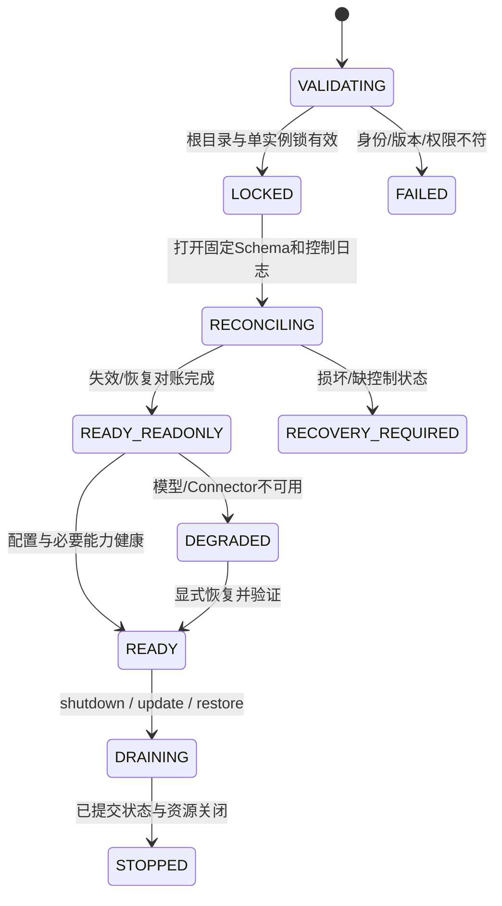

# 部署、启停与运维详设

状态：architecture-1 目标。首个正式桌面平台为 Windows 11 x64；Linux 用于 CI/开发验证。P1 交付本地 Web/CLI，P4 交付桌面、备份与升级。没有对应平台实测就不标 supported。

## 1. 部署组成

| 进程/文件 | 安装与启动 | 权限/数据 |
|---|---|---|
| Daemon | 独立受控 Node 进程，可信 launcher 启动 | 唯一业务写者，拥有 data/control roots |
| Pi Worker | Supervisor 按 profile 启动，显式 argv/环境/目录 | 无数据库/控制目录/客户端会话密钥，不发现宿主扩展 |
| Web UI | Daemon 固定 loopback origin 的静态资产 | HTTP/SSE 客户端，正文不进 localStorage |
| Electron main/preload | P4 本地签名包 | OS vault/通知/窗口/更新，白名单桥 |
| Electron renderer | 与 Web 共用组件，装载打包资产 | Node integration 关闭、context isolation/sandbox/CSP |
| 产品配置 | SQLite 的不可变 revision | 不消费 harness.config.json |
| 用户数据 | 显式 data-root 与独立 control-root | 路径/权限/安装身份在启动时校验 |

当前正式 Node22.23.1/npm10.9.8/Pi0.84.1 是既有验证基线，不保证永远适合发布。P4 的 Daemon 使用单独验证/打包的运行时，不能因为 Electron 内嵌另一版本 Node 就让它直接打开产品数据库。升级工具链须自己的 ADR/类型/Fixture/恢复证据。

## 2. 启动状态机



启动顺序固定：

1. 读取可信启动参数，验证目录身份/访问范围和精确运行版本；
2. 获取单实例锁，生成 daemonInstanceId；其他实例只能连接已认证服务，不能抢写；
3. 检查 installationId、固定 Schema、PRAGMA/完整性与控制日志；
4. 先施加未完成遗忘/隐私收紧/恢复世代，再处理旧 lease 与 staged 内容；
5. 隔离旧执行 Outbox，核对未确定 action；
6. 加载已验证配置，启动只读查询/诊断，再启动消费者、Scheduler 与健康的能力；
7. 新 UI 配对；Runtime 在 Task 需要且 profile 完整获准时启动。

不能先显示“全部正常”再后台补安全对账。READY_READONLY 允许安全查看/纠正可用数据，不允许新模型/工具派发。存储损坏或控制状态缺失时连正文只读接口也不开，只提供固定诊断与恢复入口。

## 3. 关闭与资源归属

```text
拒绝新派发 → 暂停 Scheduler/Connector 拉取 → Worker drain/abort
→ 持久化已观测结果或明确 incomplete/unknown
→ Outbox/清除作业停在可重试边界
→ 关闭数据库/内容句柄 → 释放租约与实例锁
```

每个 timer、watcher、socket、Worker、订阅和排队 job 都有 ownerId/disposer。dispose 必须可重复，失败产生明确清理状态。默认优雅关闭预算 10 秒；超时才请求终止 Worker，并把未确定 action 留给下次核对，不写成成功取消。

强制关机或进程 kill 可能截断未提交输入；只承诺已经持久提交的边界。恢复先核对状态，不能因程序启动成功就重放所有待发外部动作。

## 4. 配置对账

配置 revision 分 desired、validated、committed；running 绑定实际使用的 revision。步骤：parse→scope/policy检查→能力/目录/凭据 handle验证→prepare→health-check→提交 revision→切换新绑定→drain/dispose旧资源。

普通模型/工具选择影响下一 Session/attempt。权限收紧和数据策略收紧立即进入 T12/控制日志路径，不等待旧 Runtime 自愿刷新；宽松变化必须有新用户授权，不自动由“配置文件已写”生效。

prepare/health失败保留 last-known-good 并显示候选失败。部分资源启动成功不是 committed。下线 Provider 时停止新任务、排空安全任务、核对在途效果；不能把旧 Session 原生 ID 重用到另一 Runtime。

## 5. 凭据与本地认证

P1 的诊断 token、UI/CLI 会话、模型/Connector 凭据是三个权限域。模型 secret 由可信启动器显式注入指定 Broker，不放 SQLite 普通配置、对话、argv、日志或 Worker 通用环境。P4 用 OS vault，数据库仅存 opaque handle 与状态。

UI pairing code 一次使用、默认 5 分钟，凭可信启动器 fragment/桌面桥交换会话；Daemon 重启使内存认证会话失效。Web 重新配对，桌面可通过受控桥重新建立会话。Cookie 使用 HttpOnly/SameSite=Strict、固定 Host/Origin/CSRF；P1 literal loopback HTTP 不声称 TLS 认证服务端。

外部 cursor 的专用密钥按 principal+Scope 在内存持有；key registry 有上限（默认 64 个活跃命名空间），超限/重启/轮换让旧 cursor_expired 并触发快照同步。nonce 冲突重试有界，随机源或加密能力不可用则不签发 token。实现使用平台 [Node crypto](https://nodejs.org/docs/latest-v22.x/api/crypto.html) 的认证加密接口，不能自行编写密码原语；固定工具链上的兼容与篡改/重放负例在 P1 实测。

同用户恶意进程可窃取内存/文件、替换程序或抢端口的风险不在这些凭据边界的保证内。不能把 Bearer、Cookie 或 renderer sandbox 当作整个系统的 OS 沙箱。

## 6. 备份格式与密钥选择

选择版本化 ZIP 业务容器 + age v1 加密。容器仅有 manifest.json、产品 SQLite 一致快照、受管内容对象及必要无正文元数据；entry 名是固定相对路径/opaque ID，无符号链接、绝对路径或父目录跳转。manifest 记录安装/Schema/应用版本、control watermark、内容库存与允许缺失原因，不能只备份 sqlite 主文件而忽略 WAL/正文一致性。

age 采用 recipient/identity 模式，自动备份只需要公钥；解密 identity 放 OS vault，首次启用时让用户保存独立恢复密钥，不能与备份同目录自动明文存放。实现选用上游维护的 TypeScript `age-encryption`（typage），在 P4-06 精确锁定版本/依赖闭包并与独立 age 实现互操作验证；本任务不安装依赖。依据：[age 格式](https://age-encryption.org/v1)、[typage 官方实现](https://github.com/FiloSottile/typage)（2026-10-09 核对）。

加密保证不能替代来源授权/反回生。普通备份不包含诊断/UI/model/Connector secret、cursor 密钥、可重新激活的会话或当前恢复控制根。加密文件通过认证后仍是输入：解包要限制 entry 数量、总解压大小、路径、类型和重复条目，不能直接覆盖 live 目录。

age recipient 公钥可被其他人用于加密，因此“可以解密”不能证明备份由本安装生成。完成备份后，在不随旧备份回滚的可信 backup-catalog 登记 backupId/revision、密文摘要、安装身份、Schema 与 control watermark；恢复先比对该独立记录。未知/自报匹配的备份不作为可信恢复启用；跨安装导入须另有明确可信恢复资料与权限，不因文件内的 hash/installationId 自洽就放行。

备份成功顺序是：隔离生成→校验→加密到新文件→flush/完成目标文件→durable 登记可信目录→返回 success。登记失败留下的文件是未登记孤儿，不因后来扫描到它就自动获得可信身份。替代/清除备份同样先登记新 revision，再使旧副本失效，失败如实报告，不覆盖唯一可恢复副本后再尝试验证。

## 7. 备份、保留与物理清除

首版选择短时 quiescent 备份：暂停接纳新的执行/归纳/清除写作业，等待当前工作到安全边界；超时返回 busy/unavailable，不强杀正在进行的用户任务。数据库和正文无写入后建立一致副本，随后恢复服务并在副本上打包/加密。

默认 7 日/4 周/3 月是备份数量上限，不是延长正文保留的许可。普通正文的保留终点也覆盖受管备份。到期/物理遗忘时先使相关旧备份恢复资格失效，再生成已施加清除的替代副本、重新校验/加密并移除旧副本；也可直接删除整份受管备份。无法处理锁定/离线副本时报告 pending/partial，不能声称物理清除完成。

替代备份不原位修改业务真源：在隔离副本用受审清除/恢复工具施加控制记录，再生成新 manifest/revision，旧加密文件的外部复制品属于明确不可控范围。清除操作必须覆盖副本中的正文重复表示、FTS、摘要和内容指纹。不能只删 live 文件而保留备份中的可恢复正文。

恢复密钥可解密文件不等于具备最新控制状态。需要把不随旧备份回滚的 control head/日志安全保存在可用位置；失去全部可信控制状态时拒绝自动启用旧资料，并解释限制。控制状态的受管副本更新与恢复校验在 P4-06 单独演练，不以密钥存在替代它。

## 8. 恢复与升级

恢复采用[持久化详设](persistence-and-recovery.md#9-备份恢复时序)的隔离、重放控制、全量校验、new recoveryEpoch 和切换流程。旧 Grant/会话/预算/自动任务失效，新数据接入与模型/工具目的需要当前用户重新确认，不恢复旧同意。

若 RESTORE_BEGIN 已持久而候选切换失败，不能把 recoveryEpoch 倒退。可以对旧有效库施加当前控制记录和新世代后恢复只读服务，但旧授权/自动任务仍失效，界面说明需要重新授权。这样恢复失败不会偷偷复活旧运行权限。

升级状态为 downloaded→verified→prepared→migrating→validated→switched。验证包来源/签名与依赖清单；迁移前确认有可恢复副本和匹配控制状态。失败保留旧有效版本或进入明确恢复模式；新 Schema 不能让旧二进制直接打开，回滚软件不等于回滚数据。

安装包、updater、vault 与通知在 Windows 真机验收；Linux CI 不替代 Windows 能力证明。发布所需签名/分发权限未具备时，保留可验证构建并报告发布阻塞，不假称已发布。许可证及依赖分发清单在 P4 发布门完成，当前仓库许可不因设计变更而改变。

## 9. 可观察性

| 指标/事件 | 目的 | 禁止包含 |
|---|---|---|
| command_latency / commit_latency / queue_depth | 接口与持久延迟 | 请求正文、真实路径 |
| runtime_state / binding_epoch / event_gap | 进程/协议诊断 | raw Runtime dump |
| model_tokens / budget_state / exposure_state | 成本与发送边界 | Prompt/secret/原始思维链 |
| eligible_count / selected_count / stale_rejection | 记忆质量与失效 | 未授权对象的名称/内容 |
| learning_job / trial_outcome / unknown_attribution | 学习可解释性 | 把 unknown 计为成功 |
| attention_suppressed / notification_count | 打扰与遗漏 | 不受限的用户行为画像 |
| purge_pending / restore_phase / control_lag | 删除/恢复是否真正完成 | 被删原文/摘要/hash |

指标带受控 task/attempt/operation ID、版本和固定类别；Scope 过滤适用于诊断查询。外部遥测默认关闭。用户选择导出诊断时先生成脱敏预览与明确范围，不直接打包整个 data-root。

## 10. 资源与容量初值

| 项目 | 首版初值 | 超限行为 |
|---|---|---|
| 执行并发 | P1=1，P4总2/每Workspace1 | 持久排队，交互高于学习/主动 |
| Coordinator 决策 | 每边界最多2次模型调用 | 格式/能力/未知明确失败或等待 |
| 学习 | 每任务后最多1次、每日10次 | 排队/跳过有记录，不抢交互 |
| API / 附件 | 1 MiB / 20 MiB | 413，不先读取全部再拒绝 |
| Event queue | 每binding 256条或1MiB结构事件 | 背压/明确incomplete，不丢唯一终态 |
| SSE 客户端 | 每Daemon默认32条订阅 | 拒绝新订阅，可用查询快照 |
| 任务/模型时限 | 由Task/Profile/Grant显式给定 | 耗尽停止新派发，保留在途核对 |
| graceful shutdown | 10秒 | 显式强停与unknown/incomplete，不伪成功 |

这些是有界资源默认值，不是实测性能。搜索/编译延迟与 100k/10k 负载使用已定验收预算；调整值需记录测量和影响，安全语义不随调优改变。

## 11. 故障处置入口

| 状况 | 系统自动行为 | 用户/维护者动作 |
|---|---|---|
| 模型/Connector不可用 | 保留安全本地功能，停止相应派发 | 检查配置/凭据，显式重试 |
| SQLITE_BUSY/临时锁 | 在明确小预算内重试事务起点 | 持续失败显示busy，不关闭完整性检查 |
| 磁盘满 | 拒绝未提交操作，保留原状态 | 清理获准副本/扩容后重试 |
| Schema/内容损坏 | 停用相关数据读取/执行 | 隔离恢复/诊断，不自动“修表” |
| 控制日志缺失/错head | RECOVERY_REQUIRED | 找回可信控制状态，不能空初始化 |
| 外部写结果未知 | NEEDS_RECONCILIATION | 查回执或用户核对，不再点普通重试 |
| 清除失败/离线备份 | 逻辑继续拒绝，物理状态partial | 处理受管副本；明确外部范围 |
| 密钥丢失 | encrypted backup不可解密 | 使用已保存恢复密钥；不能绕过加密 |

每项自动行为对应具体错误码、当前状态和后续触发条件，不能用统一“暂时出错了”掩盖是否已经发生副作用。
