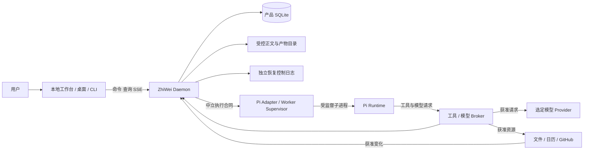
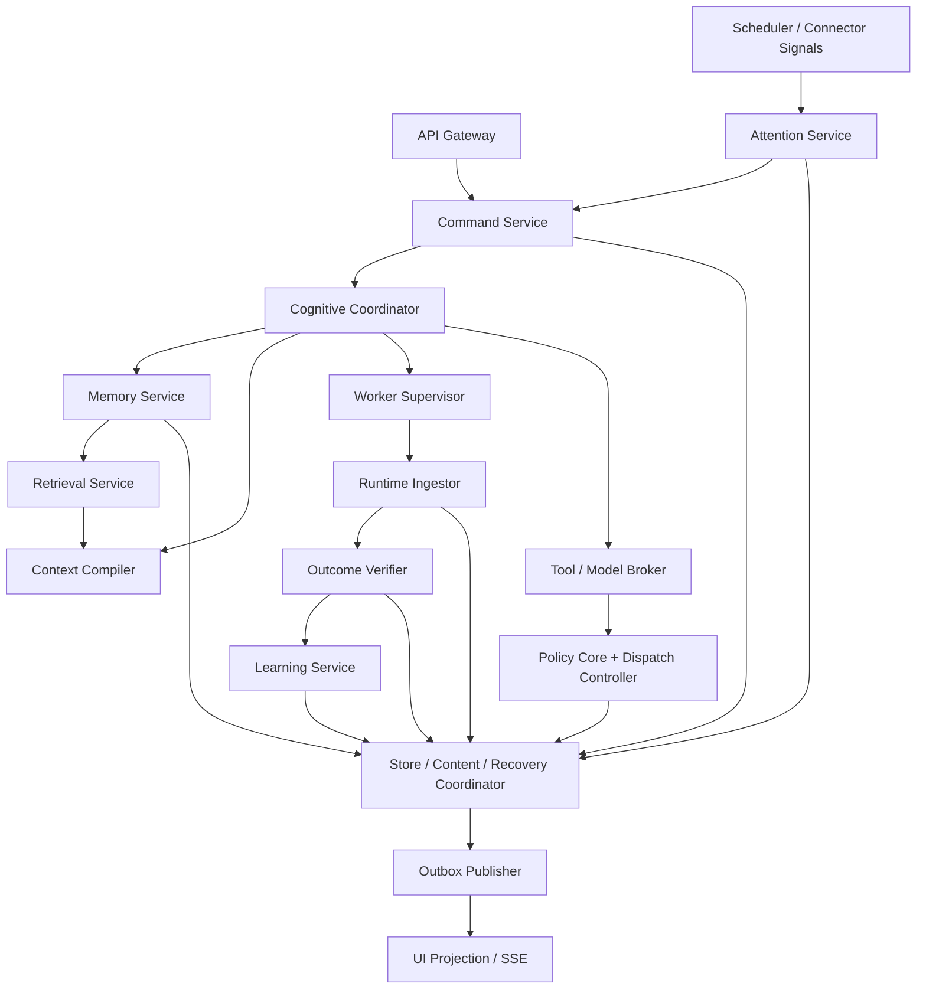
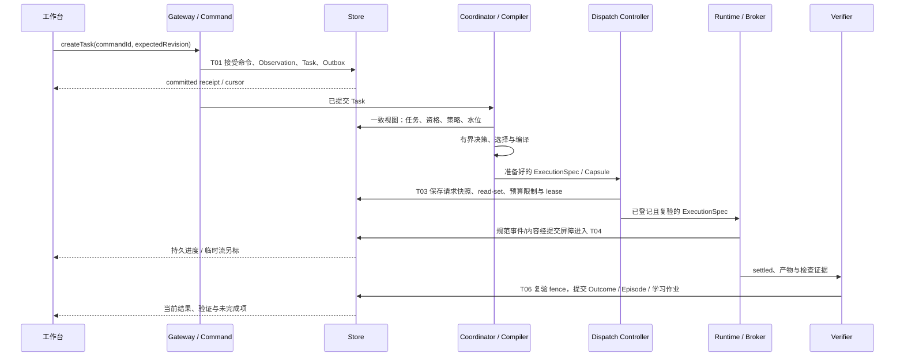

# 知微详细架构设计

版本：design-v2 / architecture-1，2026-10-09，工作项 #96。本文细化已接受的 ADR0016/0017；新增并发与恢复选择见 [ADR0018](../adr/0018-detailed-coordination-and-persistence.md)。这是一份实现合同，图中的目标模块不代表当前代码已经交付。

## 1. 如何使用这份设计

| 需要回答的问题 | 详细来源 | 对应实现 |
|---|---|---|
| 系统为什么这样分层、代码放哪里、模块如何调用 | 本文 | P1-01—08 |
| Task/Session/Worker 如何推进，如何拒绝过期结果 | [运行与协调](runtime-coordination.md) | P1-03/04/06/07、P4-01/02 |
| 表、主键、索引、版本、正文、事务与恢复顺序 | [持久化与恢复](persistence-and-recovery.md) | P1-02/05、P4-06 |
| 客户端发送什么，事件和错误如何解释 | [本地接口详设](local-api-contract.md) | P1-04/08、P3—P5 |
| 记忆如何形成、检索、进入上下文、变成经验 | [认知算法与流水线](cognitive-pipelines.md) | P1-05—07、P2 |
| 启停、配置、凭据、备份、升级与诊断 | [部署与运维](deployment-and-operations.md) | P1-03/04、P4-02/05/06 |
| 哪个字段/端口/事务属于谁，哪些场景覆盖它 | [架构索引](architecture-catalog.json) | 设计一致性检查 |

产品目标由[产品愿景](../product/product-vision.md)决定，长期不变量由[领域模型](domain-model.md)与[安全合同](trust-and-safety.md)决定。本文系列负责把它们展开为代码可消费的边界；同一字段、操作或事务只在对应专篇定义，其余文档链接引用。遇到冲突先核对 ADR 和这份版本，不自行选择更宽松解释。

## 2. 系统上下文与部署边界



一个安装对应一个 OS 用户和一个正常 Daemon 写者。产品 SQLite、正文目录和恢复控制目录共同构成本地持久状态；正文可清除，恢复控制日志只含禁止旧数据/权限回生所需的最小受控元数据。它不是第二套记忆数据库。

Runtime 是执行能力提供者。它没有产品数据库句柄、恢复控制目录、用户授权签发能力或 UI 会话凭据。Connector 只接收已经批准的资源请求，不能因为收到网页/文件中的指令而扩展权限。外部 Agent 在 P5 也只通过受保护 API/MCP 接入。

P1 的运行单位为“一个活跃 TaskAttempt 对应一个受监督 Worker 绑定”；P4 扩至默认总并发 2、每 Workspace 1。逻辑 Session 跨多个 Task 存续，RuntimeSession/WorkerInstance 不承担长期身份。首次实现以新 attempt 创建新执行绑定；原生会话恢复只在支持矩阵与 checkpoint 合同证明后启用。

## 3. 逻辑组件与控制流



图中 Service 是进程内责任划分，不是微服务或必需新增 npm 包。纯业务规则放 cognition-core；HTTP handler、UI store、Worker 回调仅做解析/编排/调用，不复制规则。

| ID / 组件 | 唯一责任 | 输入 → 输出 | 禁止承担 |
|---|---|---|---|
| C01 API Gateway | 认证、Origin/CSRF、DTO、大小/频率、错误映射 | HTTP/IPC → AuthenticatedCommand | 直接改 Claim/执行工具 |
| C02 Command Service | 幂等、revision、命令路由与提交 | Command → CommandReceipt | 用响应写成功替代提交 |
| C03 Cognitive Coordinator | 有界决策与 TaskAttempt 编排 | Task/WorkingState → Decision/DispatchRequest | 自研 token/tool loop |
| C04 Memory Service | 证据接受、纠正、冲突、遗忘的业务编排 | MemoryCommand → Transition | 将模型自由文本直接当真源 |
| C05 Retrieval Service | 获取合格候选、按任务检索与解释 | ScopedQuery → QualifiedMaterial[] | 先全库排序再过滤 |
| C06 Context Compiler | 确定性选择、预算、有序渲染、引用 | QualifiedMaterial[] → Capsule | I/O、模型或状态写入 |
| C07 Policy Core | 纯函数判断动作/外发/预算的资格 | Action + 当前策略 → Allow/Ask/Deny | 发放未获用户授权的 Grant |
| C08 Dispatch Controller | 执行准备、授权复验、预留、唯一派发、在途登记 | ExecutionSpec/AllowedAction → Binding/ActionHandle | 盲目重试未知副作用 |
| C09 Worker Supervisor | spawn/bind/drain/stop、lease 与实例身份 | ExecutionSpec → RuntimeBinding | 推断任务完成或记忆真值 |
| C10 Runtime Ingestor | 解析、规范化、顺序、关联、提交屏障 | RuntimeEvent → Observation/Progress | 从最终消息重造丢失事件 |
| C11 Outcome Verifier | 按既定 criterion 收证与判定 | Attempt + Evidence → Outcome | 由 Runtime exit 直接判成功 |
| C12 Learning Service | 幂等归纳、采用证据、试用与晋升编排 | Outcome/Episode → Candidate/Trial | 修改核心代码或权限 |
| C13 Attention Service | 目标相关性、时机、准备/提醒、反馈 | Signal → AttentionDecision | 越过 Policy 直接外部写 |
| C14 Scheduler / Connector Host | 可撤销订阅、时间唤醒、资源归属 | due/event → DurableJob/Signal | 用模型轮询进度 |
| C15 Persistence Coordinator | Schema/事务/read-set/fence、内容与恢复协调 | Transition → DurableReceipt | 解释候选是真是假 |
| C16 Outbox / Projection | 至少一次投递、去重、水位、快照订阅 | CommittedEvent → ReadModel/Event | 成为认知/权限真源 |
| C17 Client State | 可撤销乐观交互、流式展示、版本化缓存 | API/SSE → UI | SQLite、长期凭据、业务裁决 |
| C18 Recovery / Backup Service | 备份/恢复的应用编排、可信来源与启用顺序 | 已授权操作 → 可核验备份/恢复结果 | 在 Store 包内导入应用凭据/加密实现 |

## 4. 计划代码布局

下列是目标文件责任，不在本设计任务创建空实现。P1 的实际提交按纵向切片逐步建立它们。

```text
apps/daemon/src/
  bootstrap/          composition、startup、shutdown、single-instance
  api/                routes、authentication、request/response mapping、SSE
  application/        command-service、coordinator、memory-service、verifier
                      learning-service、attention-service、dispatch-controller
  runtime/            supervisor、ingestor、binding-registry
  infrastructure/     model-broker、tool-broker、connector-host、scheduler
                      credential-provider、outbox-publisher、clock/id adapters
apps/web/src/
  app/                navigation、client session、capability discovery
  features/           workspaces、tasks、memory、attention、settings
  data/               API client、SSE reducer、versioned query cache
apps/desktop/src/
  main/               lifecycle、window、vault、notifications、update
  preload/            fixed allowlist bridge
packages/domain/src/
  identity、scope、evidence、memory、task、procedure、policy、errors
packages/cognition-core/src/
  memory-transitions、task-transitions、policy-rules、outcome-rules
  learning-rules、attention-rules、invalidation
packages/context-compiler/src/
  eligibility、selection、budget、render、capsule
packages/memory-store/src/
  product-store-v2、repositories、unit-of-work、content-store
  recovery-journal、outbox、projections、migrations-v2
packages/protocol/src/
  local-api-v1、product-event-v1、observation-v2、runtime-port
packages/pi-adapter/src/
  worker-client、capability-profile、runtime-event mapping
packages/evals/src/
  product-scenarios、failure-injection、memory-baselines、learning-trials
```

跨包只用公开 index 导出。现有 v1 文件、固定迁移、Fixture 和 parser 保持原责任；正式 v2 入口不能让原 v1 open 接受额外表或新 payload。Client 不导入 memory-store；cognition-core/context-compiler 不导入 protocol、Node、Pi 或应用目录。

## 5. 端口与纯函数合同

所有签名是目标设计，尚非当前公开 API。ID、时间、预算、策略 revision 均从明确边界提供；不能在核心里调用系统时间或读取环境变量。

| 端口 / 定义归属 | 关键操作 | 消费者 / 实现 |
|---|---|---|
| ProductStorePort / memory-store | readView、commitTransition、claimJob、readEventPage | Daemon / SQLite 实现 |
| ContentStorePort / memory-store | reserve、stage、publish、readAuthorized、revoke、purge | 持久协调者 / 本地内容目录 |
| RecoveryControlPort / memory-store | appendIntent、readHead、reconcile、beginRestore | 恢复协调者 / 独立控制日志 |
| RuntimePort / protocol | capabilities、start、events、abort、dispose | Supervisor / Pi Adapter，P5 第二实现 |
| ModelInvocationPort / Daemon consumer contract | invokeStructured、cancel | Coordinator/学习/主动 / 受控 Broker |
| ToolExecutionPort / Daemon consumer contract | describe、start、reconcile、cancel | Dispatch Controller / 固定工具实现 |
| ConnectorPort / Daemon consumer contract | fetchChanges、normalizeSignal、dispose | Connector Host / ICS、GitHub |
| CredentialPort / Daemon consumer contract | resolveHandle、revokeHandle | Broker / 启动器或 OS vault |
| EventSubscriptionPort / protocol | snapshot、subscribe、resume | Client / API+SSE |
| BackupCodecPort / Daemon consumer contract | encryptBundle、decryptBundle、validateInventory | Recovery / Backup Service / age 加密的版本化容器 |

Daemon 自用端口由其 consumer 定义；领域包不反向依赖它。跨 Runtime 的纯中立 DTO/transport interface 放 protocol，不能包含 Pi class、数据库句柄、回调闭包身份或模型 Provider 原生类型。

```typescript
// 描述性签名，具体字段由相应详设定义；不是可直接导入的实现。
type Transition = Readonly<{
  readSet: readonly ExpectedObjectVersion[];
  writes: readonly DomainMutation[];
  events: readonly DomainEventProposal[];
  contentActions: readonly ContentDisposition[];
}>;

function applyMemoryCommand(state: MemoryView, command: MemoryCommand,
  context: RuleContext): Result<Transition, DomainError>;
function evaluatePolicy(action: ActionDescriptor, state: PolicyView,
  context: RuleContext): PolicyDecision;
function compileContext(input: QualifiedContextInput,
  budget: ContextBudget, tokenizer: TokenCounter): Result<ContextCapsule, DomainError>;
function evaluateOutcome(spec: AcceptanceSpec,
  evidence: readonly CriterionEvidence[]): OutcomeDecision;

interface ProductStorePort {
  readView(query: ScopedRead): Promise<VersionedReadView>;
  commitTransition(plan: Transition, guard: CommitGuard): Promise<CommitReceipt>;
}
```

Transition 是经过核心验证的业务写入计划，不是任意 SQL。Store 仍重验协议、关系、read-set、fence、有效期与完整性；应用不能通过拼 DomainMutation 绕过公开写入口的校验。领域判断在纯核心，持久条件在 Store，两者不是可互换的重复校验。

## 6. 一条用户请求如何穿过系统



命令提交后可以返回 202/receipt，任务无需占住 HTTP 请求。响应丢失依 commandId/幂等键查询；UI 只有收到 committed receipt 或版本化事件才显示持久成功。完整 T 编号定义在[事务目录](persistence-and-recovery.md#6-事务目录)。

## 7. 认知真源与派生数据

| 层 | 内容 | 能否直接作为下一轮事实 |
|---|---|---|
| 原始证据 | 获准 Observation 与原始来源片段 | 需检查来源、范围、可用性和有效时间 |
| 已治理状态 | Claim 版本、Goal/Task、授权、已验证 Outcome | 按各对象当前资格 |
| 经历/做法 | Episode、Procedure 版本、采用/试用记录 | 经历保留已知/未知；做法需当前适用与晋升资格 |
| 派生表示 | FTS、摘要、向量、关系投影、UI cache、CapabilityProfile | 不独立赋予真值或权限，失效后重建 |
| 本轮请求 | 不可变 Capsule/RequestSnapshot | 只解释该请求；新发送/结果提交仍重验 |

模型产物只能进入候选/假设/有来源的派生层。经过明确业务规则接受的 Claim/Procedure 是受治理的版本化对象；“模型生成”本身不是接受依据。运行日志和前端缓存不能补回已遗忘正文。

## 8. 一致性选择

选用单正常写者 + SQLite 事务 + optimistic revision/read-set + admission gate。它解决四种不同问题：事务保证多对象原子提交，revision 拒绝并发覆盖，epoch 拒绝失效资格，admission gate 定义撤销与派发的先后。

所有网络、模型、文件大块 I/O 都在 SQL 事务外。模型调用期间不持有数据库写锁；提交前重新读有效状态并 CAS。正好发生在发布/派发前的纠正、遗忘、撤权在提交屏障处拒绝旧结果。已经进入受控执行器的在途请求另行取消/核对，不能声称远端未收到。

Outbox 是至少一次，不承诺系统全局 exactly-once。每个消费者具备明确幂等键；外部未知结果保留 UNKNOWN/NEEDS_RECONCILIATION。正文文件和 SQLite 不假装具有跨介质原子事务，采用 staging→检查→可见引用及孤儿/清除恢复协议。

## 9. 扩展与版本

P1 只接一个正式 Runtime 与少数固定工具；P2 扩展学习，不扩权限；P3 扩信号与主动准备；P4 扩有界后台写和桌面；P5 才稳定跨 Runtime/MCP。新增 Provider 必须通过相同端口、错误和失效场景，不能用可选字段吞掉来源差异。

API、ProductEvent、Observation、RuntimeEvent、数据库 migration 和 PromptAsset 分别有版本。它们不是同一个数字。旧事件使用旧 parser；未知主版本拒绝；派生投影可重建不意味着持久合同可以随意改写。具体兼容矩阵见[运行详设](runtime-coordination.md)。

## 10. 实施交接与完成标准

新实现提交必须能回答：本次服务的公开入口是什么、依赖哪份 read view、核心用哪条转换规则、哪个 T 事务提交、哪个 fence 拒绝竞争、哪个 Z 场景验证。回答不全时补本任务的具体合同，不先增加通用框架。

架构完成不以文件/接口数量评价。P1-09 必须实际走通工作台→任务→Runtime→结果→下一次会话；P2/P3/P4 分别用已有质量门证明学习、主动与执行。此详设不放行旧 D-04/D-08/G-5 的未完成实证，不改变当前 P0。
