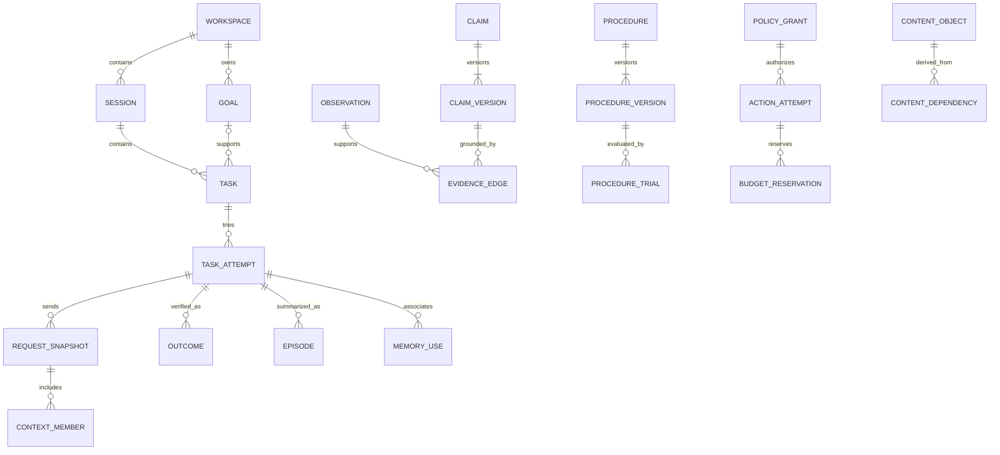
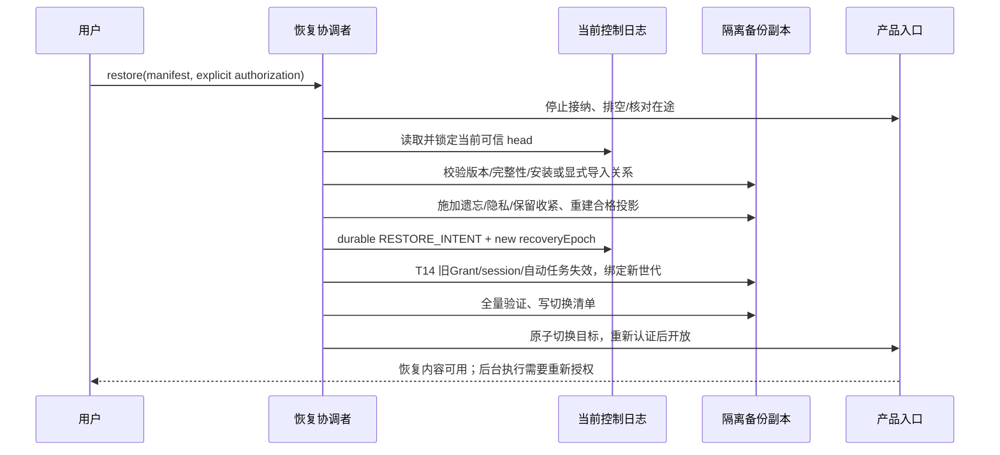

# 持久化、事务与恢复详设

状态：architecture-1 逻辑 Schema 与提交合同，不是已应用 migration。P1-02/05 与 P4-06 按此实现；原 Ledger v1/0001/公开 parser/完整性检查不改。字段的业务含义仍由[领域模型](domain-model.md)决定。

## 1. 物理存储与权威性

```text
data-root/
  product.sqlite              认知、任务、授权、Outbox、投影水位
  product.sqlite-wal/shm      SQLite 管理，属于保留/备份范围
  content/staging/            不可被普通查询读取的待发布正文
  content/objects/            以随机 contentId 定位的获准正文/产物
  projections/               可重建的非 SQLite 派生索引
  recovery-staging/           尚未对外启用的恢复候选
  diagnostics/                无正文的固定类别诊断
control-root/                 不随 product 备份回滚
  installation.json          安装身份、格式版本、当前恢复世代
  recovery.log               遗忘/恢复意图的单调最小控制记录
  recovery.head              已完整持久化记录的校验锚点
  backup-catalog             可信备份身份/密文摘要/控制水位，不随旧备份回滚
```

路径由可信启动器选择并校验普通文件/目录身份，不能来自模型输出。两根可以在同一物理磁盘，但恢复产品备份的流程不得覆盖 control-root；这不能抵御磁盘整体丢失或管理员同时回滚两者。恢复控制状态不可获得时，旧产品数据保持不可用，不凭空创建新空日志来“修复”。

只有 product.sqlite 是业务数据库；recovery.log 不是第二个 Claim/Task Store，而是不可随备份撤回的控制真源。所有写者是同一 Daemon 的 Persistence Coordinator；禁止客户端/Worker直接打开任一文件。

## 2. 通用数据规则

- 主键是不可复用的 opaque ID；业务 ID 不使用自增行号、文件路径或模型生成文本。内部 cursor 可以单调递增，但不直接作为外部授权。
- UTC 时间使用验证过的 ISO 时间表示，时间/ID 在可信边界注入。revision/epoch 为有界非负整数，溢出拒绝，不能绕回。
- 每个可查询对象都有明确 scopeId。Workspace 子对象使用组合外键防误关联；Global、Workspace、Task、Session 的包含关系仍由核心规则校验，SQL 外键不能代替权限。
- 每个内容版本不可原地改正文/来源/有效时间。生命周期字段可以按合法 Transition 更新，同时追加状态变化记录；原内容和先前状态的历史引用保留到相应保留终点。
- 名称、用户原话、事实值、资源路径、工具参数、错误正文、摘要及正文 hash 都按内容策略处理，不能因为字段叫 metadata 就永久保留。正文指纹存在可清除的内容记录中，不复制到永久审计。
- 新表使用 STRICT、显式 NOT NULL/CHECK/UNIQUE/FK 与索引；应用公开边界仍做正式 schema/parser 校验。SQLite 动态 JSON 不成为跳过领域校验的理由。

## 3. 实体关系



图中聚合历史不是数据库全部列。下表为完整逻辑数据字典；实施 migration 可以调整物理拆分，但主键、唯一性、作用域、保留和事务语义改变须新决策，不能只改 SQL。

## 4. 逻辑表目录

记号：`PK` 主键；`UQ` 唯一键；`FK` 外键；`Ref` 为精确版本引用；`ContentRef` 是受保留策略控制的正文引用。所有表另有 formatVersion 与必要时间字段，不在每行重复。

这是完整产品的逻辑职责目录，不要求 P1 一次建齐所有表。P1 落地当前任务实际消费的证据/内容/任务/记忆/请求/结果及最小权限/事件结构；学习表在 P2，承诺/连接器/主动表在 P3，完整委托/备份表在 P4。实际物理合并或拆分不得丢失这些约束，也不为远期能力先建空 Repository。

### 身份、配置与工作

| 表 | 主键与必有字段 | 关键约束 / 索引 |
|---|---|---|
| workspace | PK id；labelRef、purposeRef、dataPolicyRevision、status | label/purpose 是内容；禁用 Workspace 不删除历史 |
| scope_catalog | PK id；kind、workspaceId?、taskId?、sessionId? | global 无子身份；task/session 的 Workspace 必须一致；scope 创建后不漂移 |
| scope_epoch | PK scopeId；cognitionEpoch、policyEpoch | Global 与 Workspace 分别计数；只在相关资格改变时提升 |
| config_revision | PK (configId, revision)；scopeId、bodyRef、status | 内容不可改；一个 configId 只有一个 committed current |
| session | PK id；workspaceId、contractRevision、status | UQ (workspaceId,id)，Workspace 不可修改 |
| session_contract | PK (sessionId,revision)；runtime/model/tool/policy/data/compiler profile refs | 每 request 固定版本；配置内容也受保留 |
| goal | PK id；workspaceId、revision、intentRef、criteriaRef、status、deadline? | 用户确认 Observation Ref；Goal 修改有新 revision |
| task | PK id；workspaceId、sessionId、goalId?、revision、intentRevision、status、activeAttemptId? | FK (workspaceId,sessionId)；最多一个 active attempt |
| task_intent | PK (taskId,intentRevision)；requestRef、criteriaRef、limitsRef、sourceObservationRef | 不可改；修改验收必须新版本 |
| task_attempt | PK id；taskId、attemptNo、intentRevision、state、fenceRef、terminalOutcomeId? | UQ(taskId,attemptNo)；state 与活跃指针同事务 |
| checkpoint | PK id；attemptId、stepKey、stateRef、inputVersionRefs、recoveryClass | UQ(attemptId,stepKey,revision)；不含可自动复活授权 |
| criterion | PK (taskId,intentRevision,key)；kind、specRef、required | key 唯一；验证结果不能修改此标准 |
| artifact | PK (id,version)；scopeId、attemptId、contentId、availability、validationRef | 产物版本不覆盖；路径不能当稳定身份 |

### 证据、正文与认知

| 表 | 主键与必有字段 | 关键约束 / 索引 |
|---|---|---|
| source_stream | PK id；adapter、surface、runtime/session/instance identity、sequenceRule、state | 来源域不按墙钟合并；来源字段来自可信 Adapter |
| observation_v2 | PK id；scopeId、streamId、sourceSequence、observedAt、recordedAt、kind、contentId?、availability | UQ(streamId,sourceSequence)；仅受控元数据不可语义覆写 |
| ingest_checkpoint | PK streamId；committedSequence、state、gapRefs | 与对应事件同事务；不是 received/模型完成水位 |
| content_object | PK id；scopeId、privacy、state、purpose、retentionUntil、locator、digest?、byteCount?、ownerAttempt? | locator 是受控内部定位；digest/大小也可按清除策略移除；staged 默认不可读 |
| content_dependency | PK (derivedId,sourceId,sourceVersion)；relation | 范围/隐私不得变宽；任一必要来源失效就禁用派生 |
| memory_candidate | PK id；scopeId、proposalRef、evidenceRefs、extractorRevision、state、expiresAt | UQ(sourceSetKey,extractorRevision,proposalKey)；这些 key 不保留被遗忘内容指纹 |
| claim | PK id；scopeId、currentVersion、revision | 只指向同 scope 的有效版本；不从 kind 自动改变作用域 |
| claim_version | PK (claimId,version)；contentId、kind、epistemic、validFrom/Until、lifecycle、supersededBy? | 内容/证据/有效时间不可原位改；索引(scopeId,lifecycle,validFrom,validUntil) |
| evidence_edge | PK (claimId,version,observationId,role)；sourceVersion、selectorRef? | role 为 supports/refutes；selector 定位原文而非只有模型总结 |
| hypothesis | PK (id,version)；scopeId、propositionRef、evidenceRefs、verificationPlanRef、state、expiresAt | OPEN/SUPPORTED 不直接提供事实或权限 |
| episode | PK (id,version)；scopeId、attemptId、goalIntentRef、actionRefs、outcomeRef、summaryRef、unresolvedRefs | UQ(attemptId,version)；摘要可重建，失败与未知保留 |
| dependency_edge | PK (sourceKind,sourceId,sourceVersion,targetKind,targetId,targetVersion)；required | 反向索引(sourceId,sourceVersion)与(targetId,targetVersion)；不能只登记正向检索链接 |
| source_suppression | PK (scopeId,bindingId,resourceId)；controlRecordId、status、rearmAuthorizationRef? | 仅受控身份，无正文/语义指纹；恢复摄取须新授权，不解除旧对象遗忘 |
| lifecycle_change | PK id；entityKind/id/version、fromState、toState、reasonCode、sourceRef、committedCursor | 与状态变化同事务；无被删正文/自由文本原因 |

源文本的 claim 值、命题 key、原文 selector、资源描述等可能泄露信息；需要搜索的字段属于可清除索引，不可永久留在 immutable 元数据。逻辑同一性在内容可用时比较；内容已遗忘后，重复导入按 tombstone 拒绝，不能保留原 hash 来继续做隐藏匹配。

### 请求、结果与学习

| 表 | 主键与必有字段 | 关键约束 / 索引 |
|---|---|---|
| execution_unit | PK id；ownerKind、ownerRef、sourceTaskRef?、state | ownerKind 为 task_attempt/cognitive_job，精确 FK/分支校验；不为后台模型调用伪造用户 Task |
| request_snapshot | PK id；kind、executionUnitId、sourceAttemptId?、requestOrdinal、parentSnapshotRef?、contract/compiler revision、fence、bodyRef、sendState、reconstructionAvailability | kind 区分 runtime_input 与 model_request；UQ(executionUnitId,requestOrdinal)；提交后有序组成不可改 |
| context_member | PK (snapshotId,position)；sourceKind/id/version、renderedContentRef、role、selectionReason | position 连续；正文 hash 不作为唯一可重建材料 |
| memory_use | PK id；attemptId、snapshotId、materialRef、exposure、adoption、outcomeRef?、benefitRef? | UQ(snapshotId,materialRef)；各信号独立，不自动一起记功 |
| outcome | PK (id,revision)；attemptId、intentRevision、result、verifierRevision、evidenceRefs、published | 一次新判定追加 revision；旧判定可解释 |
| outcome_criterion | PK (outcomeId,revision,criterionKey)；pass/fail/unknown/not-applicable、evidenceRef、reasonCode | FK 到原 criterion；未知不得被省略 |
| procedure | PK id；scopeId、currentVersion、previousActiveVersion? | 一个当前 ACTIVE 版本；状态不赋予工具权限 |
| procedure_version | PK (procedureId,version)；specRef、sourceEpisodeRefs、state、policyRevision | 修改内容新版本回到 TRIAL；有前提/步骤/验证/失败边界 |
| procedure_trial | PK id；procedureVersion、attemptId、assignmentRef、adoptionRef、outcomeRef、benefitRef | UQ(procedureVersion,attemptId)；保留失败/未知，不重复累样本 |
| cognitive_job | PK id/FK durable_job；purpose、sourceRefs、inputContractRef、outputKind、budgetProfile | purpose 为 learning/attention 等固定类型；自己的 lease，工具 none |
| learning_job | PK id/FK cognitive_job；attemptId、outcomeRevision、learnerRevision、resultRefs | UQ(attemptId,outcomeRevision,learnerRevision)；与 Outcome 同事务创建，调度状态只在 durable_job |
| decision_record | PK id；executionUnitId、decisionKind、inputVersionRefs、proposalRef、validationResult、reasonCode | 只保留动作/依据/结果摘要；不保存原始思维链 |

### 权限、作业、主动与事件

| 表 | 主键与必有字段 | 关键约束 / 索引 |
|---|---|---|
| policy_grant | PK id；scopeId、principal、revision、ruleRef、status、expiresAt、recoveryEpoch | 规则与资源描述是受保护内容；旧恢复世代的 Grant 永不匹配 |
| policy_decision | PK id；actionId、grantRefs、policyRevision、fence、decision、reasonCode | ALLOW 只对精确 action 版本有效；不能充当长期 Grant |
| action_attempt | PK id；executionUnitId、sourceTaskRef?、sourceAttemptId?、actionOrdinal、kind、descriptorRef、idempotencyKey、state、receiptRef?、fence | UQ(executionUnitId,actionOrdinal)；owner 来自该 unit，外部 key 与参数版本绑定；cognitive_job 仅可 model.invoke |
| budget_reservation | PK id；grantId、actionId、token/count/cost caps、used、state | 同一额度事务预留；UNKNOWN 不自动释放为可复用额度 |
| worker_binding | PK id；executionUnitId、instanceId、runtimeSessionRefs、leaseEpoch、profileRevision、state | 一个 active execution unit 对应一个 active binding；PID 仅诊断 |
| durable_job | PK id；kind、scopeId、ownerRef、dueAt、priority、state、idempotencyKey | UQ(kind,idempotencyKey)；索引(state,dueAt,priority) |
| job_lease | PK jobId；ownerInstanceId、leaseEpoch、expiresAt | CAS 领取/续租；过期 owner 不可写当前结果 |
| commitment | PK (id,revision)；goalRef、scopeId、sourceRef、triggerSpecRef、state | 用户确认，取消同时取消对应唤醒 |
| signal | PK id；scopeId、connectorId?、sourceVersion、kind、deltaRef、expiresAt | UQ(source identity,sourceVersion,kind)；无新变化不重复生成 |
| attention_item | PK id；scopeId、goal/commitmentRef、signalRef、reasonRef、actionRef、state、expiresAt | 语义事项键与证据去重键分开；更新证据不重发同一提醒 |
| attention_feedback | PK id；itemId、userCommandId、kind、until? | userCommandId 幂等；disable 为强规则 |
| connector_config | PK (id,revision)；scopeId、profileRef、credentialHandle、state | 凭据正文不在表内；停止后不再抓取 |
| connector_cursor | PK connectorId；sourcePositionRef、revision、lastSuccessAt | 只在变更已提交后前进；来源原 cursor 可敏感 |
| outbox | PK eventId；commitCursor、type、scopeId、aggregateRef、payloadRef?、publishState | 与业务状态同事务；正文引用在发布时复验 |
| consumer_cursor | PK (consumerId,scopeKey,generation)；commitCursor、revision | 去重处理与游标前进同一消费者事务 |
| idempotency_receipt | PK (principalId,commandKind,key)；requestFingerprintRef、resultRef、status、expiresAt | 相同 key 不同输入拒绝；敏感 fingerprint 随内容清除 |
| deletion_projection | PK controlRecordId；appliedCursor、affectedRefs、state | 来自独立 recovery.log 的投影，不能作为唯一控制真源 |
| restore_job | PK id；backupRef、controlHead、newRecoveryEpoch、phase、validationRefs | READY_TO_SWITCH 前不对用户启用 |
| projection_checkpoint | PK (projectionId,version,scopeId)；sourceCursor、cognitionEpoch、state | 不允许用落后索引绕过当前真源过滤 |

普通状态表不是任意 SQL 的公共接口。关系、kind、状态、权限语义由正式 parser + Core + Store 的固定写命令共同校验。数据字典中的 Ref 必须能解析到具体版本，不能只保存一段自然语言 ID。

## 5. 关键约束的 SQL 形态

以下只展示结构约束，完整正式 migration 在 P1-02 建立并纳入原 manifest/真实存储测试；不可将此片段拼接到当前 v1 数据库。

```sql
-- 组合身份阻止同名 Session 被错误关联到别的 Workspace。
CREATE TABLE session_v2_example (
  id TEXT NOT NULL PRIMARY KEY,
  workspace_id TEXT NOT NULL,
  revision INTEGER NOT NULL CHECK (revision >= 1),
  UNIQUE (workspace_id, id)
) STRICT;

CREATE TABLE task_v2_example (
  id TEXT NOT NULL PRIMARY KEY,
  workspace_id TEXT NOT NULL,
  session_id TEXT NOT NULL,
  revision INTEGER NOT NULL CHECK (revision >= 1),
  intent_revision INTEGER NOT NULL CHECK (intent_revision >= 1),
  FOREIGN KEY (workspace_id, session_id)
    REFERENCES session_v2_example(workspace_id, id)
) STRICT;

CREATE TABLE attempt_v2_example (
  id TEXT NOT NULL PRIMARY KEY,
  task_id TEXT NOT NULL REFERENCES task_v2_example(id),
  attempt_no INTEGER NOT NULL CHECK (attempt_no >= 1),
  active INTEGER NOT NULL CHECK (active IN (0, 1)),
  UNIQUE (task_id, attempt_no)
) STRICT;
CREATE UNIQUE INDEX one_active_attempt_example
  ON attempt_v2_example(task_id) WHERE active = 1;
```

写状态用 `UPDATE ... WHERE revision = :expected` 并检查确切受影响行数；不能以“SELECT 时相等”替代提交时 CAS。跨表当前版本/状态/关联在同一个明确事务中验证。内容不变约束由专用写命令及 migration 的不可改字段约束实现，生命周期更新仍保留审计。

## 6. 事务目录

所有 T 事务都必须通过现有强完整性要求的正式入口。I/O 前准备业务 Transition，事务内重新验 read-set/fence/资格，任何失败整体 rollback。

| ID | 入口 | 同一事务内的读/校验与写 | 成功返回 |
|---|---|---|---|
| T01 接受命令 | createTask/用户消息 | command 幂等、Session/scope、数据许可；Observation 引用、Task/intent/初始attempt、receipt、Outbox | committedRevision + cursor；执行尚未开始 |
| T02 提交认知 | remember/correct/accept | 证据可用/范围、旧 revision；新 ClaimVersion、旧版状态、依赖失效、epoch、lifecycle、Outbox | 新版本与失效水位 |
| T03 准备执行 | Dispatch Controller | 对 task_attempt 验 Task/intent，对 cognitive_job 验 job/source版本；均验 Grant、read-set、notAfter，写 snapshot/context、必要的新 execution_unit/binding/lease 与预算上限/配置快照 | 已登记的执行准备，不代表额度已预留或请求已发送 |
| T04 摄取结果 | Ingestor | 来源序列/身份、fence、内容资格；ObservationV2、checkpoint、状态/进度、Outbox | committedSequence；不等于 Outcome |
| T05 逻辑遗忘 | Memory Service | 已 durable 的控制记录、授权范围；内容/对象 revoked、epoch、依赖禁用、清除作业、receipt | 逻辑遗忘已生效；物理清除单独报告 |
| T06 验证结果 | Verifier | Task/criterion、当前 fence、artifact/evidence；Outcome、criterion、Episode、Task终态、learning_job、Outbox | 当前结果或明确 stale/revoked |
| T07 预留动作 | Dispatch Controller | Grant/limit/revision、Action唯一性、预算可用；policy decision、reservation、AUTHORIZED action | 精确动作的预留，不可当通用能力票据 |
| T08 派发登记 | admission gate 内 | 再验 policy/cognition/recovery/lease 与期限；DISPATCHED action、发送记录 | 执行器随后启动；未知窗口可核对 |
| T09 动作结算 | 可信执行器 | action/version/receipt；CONFIRMED/FAILED/UNKNOWN、用量、相关任务核对状态 | 固定结果，不从工具完成外推目标成功 |
| T10 学习提交 | Learning Service | job key、源Outcome/依赖资格、候选规则；Candidate/Hypothesis/ProcedureTrial、job完成、Outbox | 本次学习提议/审阅结果 |
| T11 主动反馈 | Attention Service | 信号/目标/去重/冷却或用户反馈；item/feedback/预算/唤醒、Outbox | 静默/准备/提醒/已处理状态 |
| T12 撤权/配置 | Policy/Config Service | 可信用户命令、当前 revision；Grant/规则变更、policyEpoch、停止/重检作业、Outbox；影响现有数据的隐私/保留收紧先有 durable 控制记录 | 撤销已提交；在途效果另核对 |
| T13 消费确认 | Outbox consumer | eventId 未处理、当前资格；本消费者投影/去重记录/cursor | 不丢未处理事件，不重复业务效果 |
| T14 恢复启用 | Recovery Coordinator | 控制日志一致、所有校验通过；新 recoveryEpoch、旧授权 inactive、任务暂停、旧执行 Outbox隔离 | 新数据库可开放，后台执行仍需新授权 |

T14 的应用 owner 是 C18 Recovery / Backup Service，持久写入口仍是 C15；备份 codec/凭据由应用注入，memory-store 不反向导入 apps。解密成功不是来源认证，恢复必须匹配独立可信 backup-catalog 中的 backupId/revision/密文摘要/安装身份/控制水位；不信任备份内自报的同名字段。

T03 对 TaskAttempt 与 cognitive_job 使用不同的合法状态谓词：前者包含规划/执行，后者需已领取的作业 lease 与当前来源版本。它们共享持久请求/预算边界，但不能互相伪造 owner 或把后台模型调用计成新的用户任务。

T03 的 NEW_UNIT 模式建立 binding/lease；MODEL_REQUEST 模式在现有合法 binding 下仅登记该次待发送快照与预算限制，不重复分配 Worker，也不产生缺 actionId 的 reservation。T07 为该请求创建/幂等取得 action_attempt 并按 actionId 原子预留额度；T08 才接纳派发，T09 结算。不存在 T03/T07 双重扣额。Runtime 输入快照记录 Capsule/任务输入，模型请求快照记录实际可观测的有序组成并引用前者；只有真实模型发送边界产生 Exposure。

后台 learning/attention 的 action 直接绑定 cognitive_job 的 executionUnitId；没有来源 Task 时 sourceTaskRef/sourceAttemptId 为空，不借用旧 attempt 或伪造用户 Task。该单元只允许 model.invoke，使用用户启用该目的时明确授予的模型/数据/额度 Grant；有可用来源不等于有模型外发授权。T07/T08/T09 覆盖 P1 的模型/工具调用与 P2/P3 的认知调用，不等到 P4 才有结算。

### CommitGuard 检查顺序

1. 安装身份与 recoveryEpoch；
2. 当前 scope 授权、相关 policy/cognition epoch；
3. Task intent、lease/binding 与 operation 状态；
4. read-set 中每个必要对象/内容版本及当前可用性；
5. 以可信当前时间验证 notAfter/有效时间/保留终点；
6. 唯一键、语义/协议、内容引用与完整性；
7. 执行业务写入 + 事件 + Outbox + receipt，一次 commit。

任何 guard 失败都不部分应用。过期返回 unavailable/revision_conflict 等固定类别，不“刷新字段”后继续提交旧模型输出。判断结果依赖的数据均进入 read-set 或对应 epoch，不能只保护写对象。

## 7. 正文文件与数据库的一致性

```text
reserve(contentId, scope, attempt/fence, retention)
→ 对来源/授权做物化前检查
→ 写随机 staging 临时文件，受控大小，flush 后放入不可见对象位置
→ 在 T03/T04/T06 校验当前 fence 后发布 available 引用
→ 提交成功才允许读取/备份/发送
```

staging 记录可在数据库中登记，但它不属于可用认知内容。写文件与 SQL 之间崩溃的孤儿由恢复器按 reservation/文件身份对账，不以文件名猜测业务成功。写前资格已失效就不物化；写期间发生遗忘时，发布失败、staging 立即不可读并进入清除，物理清除失败显示 pending/partial，不隐瞒残留。

content_object 的正文 hash 只在内容获准期间用于完整性校验，清除时连同重复摘要/派生指纹处理。已经 purged 的幂等键/事件再次到达返回 revoked/unavailable，不通过保留原 hash 再把正文接回来。

## 8. 遗忘与恢复控制日志

recovery.log 只保存：格式版本、安装身份、controlSequence、operationId、可信授权类别、受控目标 ID/范围、操作种类、时间、前一记录校验、当前记录校验。操作为 FORGET、SOURCE_SUPPRESS、PRIVACY_RESTRICT、RETENTION_SHORTEN、RESTORE_BEGIN 及固定结果；隐私收紧只含受控枚举，保留收紧只含新的截止时间。禁止原文、路径、引用片段、任意模型字符串、正文 hash 或 token。校验链用于检测损坏与顺序，不是对恶意管理员的防回滚证明。

```text
取得控制 gate
→ 校验具体遗忘范围与当前身份
→ append FORGET_INTENT，flush/fsync，原子更新已提交 head
→ T05 施加失效并创建清除作业
→ 释放 gate，向用户返回 logical committed
→ 异步逐副本清除并追加结果状态
```

控制日志一旦持久化，不能因 T05 失败而撤回遗忘意图。gate 在日志与产品投影短窗口内阻止相关读取/发布/派发；T05 失败则系统保持 RECOVERY_REQUIRED/相关范围不可用，启动或修复先补齐投影。不能继续使用旧 DB 状态，也不能把两处写入说成一个事务。

应用于已有内容的隐私/保留收紧使用相同 control-first 顺序再执行 T12；恢复旧库先重放这些约束，不能把 local-only 恢复成 model-allowed 或延长已缩短的保留期限。仅影响未来新数据的默认设置单独标明；恢复后新数据接入/模型用途仍需当前用户重新确认。

启动时比较 control head 与 DB appliedControlSequence：日志领先则重放控制记录。若完整合法的日志记录已持久化而 head 尚未推进，先记录显式恢复、推进 head，再施加这些已授权意图；不因响应未返回而丢弃遗忘。head 领先于合法日志、DB 声称的 head 不存在/不匹配，或日志损坏/半尾、安装身份不符，直接拒绝开放正文/API执行。不能静默剪裁日志尾部或以空日志覆盖问题。允许的修复必须保留副本、核对最后可信边界并留下显式恢复记录。

删除控制记录的保留期覆盖所有还能恢复的备份；没有受管副本清单不能声称清除完成。控制根也丢失时，缺乏证明的旧备份不会自动变成可信新安装。

## 9. 备份恢复时序



切换前失败保留旧有效数据库或进入明确恢复模式；不能同时让两库成为写者。切换后首次启动验证 manifest、control head 与 recoveryEpoch 三者一致。备份中的旧预算、worker lease、session cookie、Outbox 执行请求不能重新派发；Domain 读取投影可以重建，执行消费者必须使用新授权。

## 10. 读取、索引与恢复窗口

普通读取使用一个明确 SQLite snapshot：先 scope/授权/当前状态过滤，再排序。内容 materialization 与响应发布前再次重验当前控制状态；历史查询也不能读取已遗忘内容。索引只给 candidate ID，最终 hydrate 从同一受验证真源得到版本/资格。

FTS 的文档内容属于派生正文。重建使用仍合格的 Claim/Episode/Procedure，不遍历 raw v1 inline 历史“补全”已遗忘内容。水位落后时允许明确的受限真源检索或 unavailable，不能返回缺失过滤的缓存。

## 11. 故障验证矩阵

| 注入位置 | 必须结果 | 场景 |
|---|---|---|
| T01 commit 前/后响应丢失 | 前者无 receipt、后者同键返回原 receipt | Z05/Z10 |
| Claim 新版与旧版 supersede 之间 | 整体 rollback 或共同提交 | Z04/Z05 |
| staging 写完未发布 | 不可查询/发送，可恢复清除 | Z05/Z06 |
| FORGET_INTENT 后 T05 前崩溃 | 重启先施加失效，不开放旧正文 | Z06/Z07 |
| 最后模型请求后遗忘 | late final 无当前 Artifact/学习 | Z06/Z15 |
| T07 后未 start | 证明未派发后释放，不重复计费 | Z27/Z29 |
| T08 后无外部回执 | UNKNOWN，幂等/核对而非盲重试 | Z28/Z29 |
| Outbox 投递后未确认 | 再投递幂等，游标不跨缺口 | Z12 |
| 旧备份含已撤销 Grant | 新恢复世代全部 inactive | Z31 |
| 缺日志/错安装/坏 manifest | 不启用，不降级成无校验读取 | Z02/Z07/Z31 |

## 12. 技术依据与保证范围

SQLite 只允许一个同时写事务，BEGIN IMMEDIATE 可以提前取得写事务；外键必须显式启用，复合外键需要匹配父键；STRICT 提供类型约束而非领域权限。[SQLite 事务](https://www.sqlite.org/lang_transaction.html)、[外键](https://www.sqlite.org/foreignkeys.html)、[STRICT](https://www.sqlite.org/stricttables.html)（2026-10-09 核对）。

本设计选择 WAL/FULL、明确 snapshot 和强完整性检查，但进程中断测试不证明任意硬件断电零丢失。性能目标沿用[数据总纲](data-and-api.md#性能与保证)，实测失败先改实现或另立决策，不能取消校验。
