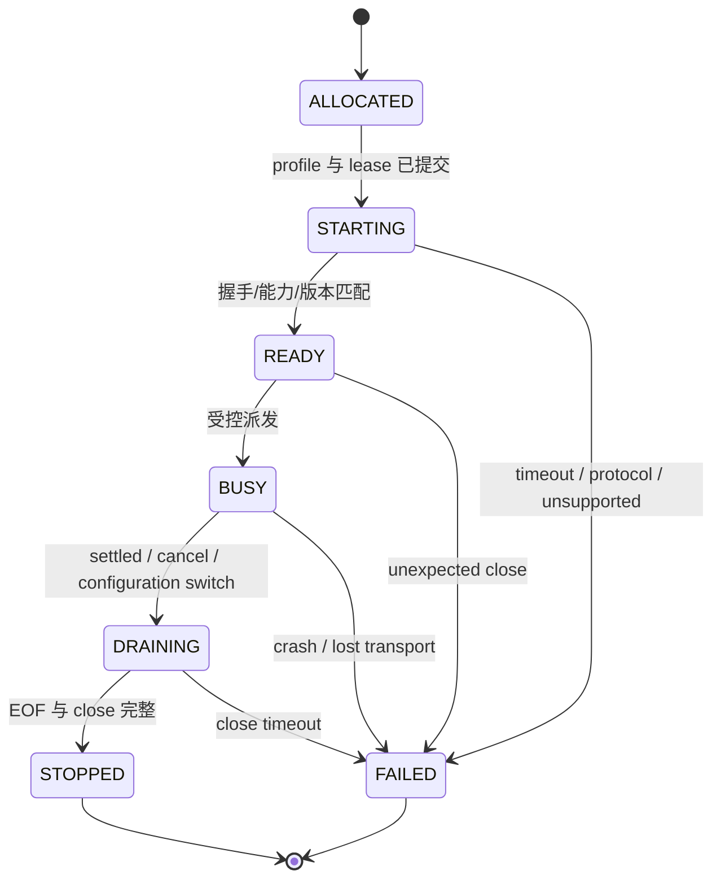
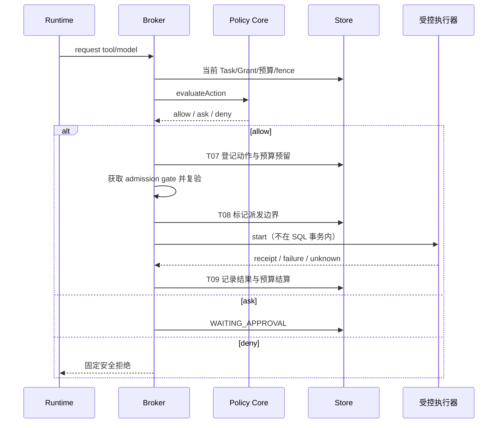

# 运行、协调与并发详设

状态：architecture-1 目标合同；依赖 ADR0016—0018。实现入口 P1-03/04/06/07、P4-01/02。现有 Pi 的真实行为范围仍以 [Pi 集成](pi-integration.md)和 Fixture 为准，不从本文推导上游已提供某项 API。

## 1. 身份与版本

| 身份 | 生命周期 / 产生者 | 必须关联 | 不能替代 |
|---|---|---|---|
| installationId | 首次初始化至完整卸载 / 启动器 | 数据根、恢复控制日志 | 用户或 Workspace |
| daemonInstanceId | 每次 Daemon 启动 / Host | 独占实例锁、恢复完成状态 | recoveryEpoch |
| workspaceId | 项目生命周期 / 命令服务 | 数据策略与 scope | Runtime cwd |
| sessionId | 用户可见逻辑会话 / Session Service | 固定 Workspace | Pi 原生 Session |
| taskId | 一项用户可验收请求 / Command Service | Session、Goal 可空、intentRevision | Prompt ID |
| attemptId | 一次具体尝试 / Coordinator | Task、输入快照、验收版本 | Runtime retry run |
| executionUnitId | 一项执行或认知作业的运行单位 / Supervisor | task_attempt 或 cognitive_job 的精确 owner | 长期 Goal 或隐式新 Task |
| runtimeSessionId | 上游实际创建 / Adapter 观测 | Runtime 类型/版本 | Worker 内存对象 |
| workerInstanceId | 每次子进程 / Supervisor | 启动 profile、传输连接、leaseEpoch | PID（可复用） |
| requestId | 每次实际模型请求 / 受控调用边界 | requestSnapshot、provider、attempt | Task 或 Turn |
| sourceStreamId | 一个协议声明的序列域 / Adapter | 来源表面、实例、序列规则 | 全局事件序 |
| actionAttemptId | 一次可能有外部效果的动作 / Dispatch Controller | Grant、资源、幂等键 | toolCallId |

Pi Prompt 可以包含多个 Agent Run，Run 可以包含多个 Turn；重试与会话替换不得被固定映射成新的用户 Task。Runtime 回调的自报 Workspace/Grant 字段不被信任；Daemon 通过实际连接的绑定表决定它属于哪个 attempt。

原生消息 role 与产品权限来源分开：Runtime 中 role=user 的编译消息不自动成为 user-direct 证据；只有认证 Gateway 接受的真实用户输入及其可追踪引用拥有该来源。工具成功只证明操作/传输事实，工具返回自由文本不自动成为 verified Claim。上游自带 ID 也不自动是可公开记录的安全字段，需受限映射/保留策略。

### Fence

```typescript
type ScopeEpochs = Readonly<{ global: number; workspace: number }>;
type ExecutionFence = Readonly<{
  installationId: string;
  recoveryEpoch: string;       // 恢复备份时换新随机世代，不从备份读取
  owner: {kind: "task_attempt" | "cognitive_job"; id: string};
  sourceTask?: {taskId: string; attemptId?: string; intentRevision: number};
  contractRevision: number;   // 本 attempt 的运行配置/能力版本
  leaseEpoch: number;         // 该执行绑定的持有者世代
  cognition: ScopeEpochs;
  policy: ScopeEpochs;
  notAfter: string;           // 相关授权/材料/任务中最早资格失效时刻
}>;
```

ScopeEpochs 只包含本轮实际允许读取的 Global 与当前 Workspace；未授权的 Global 不进入材料集合，但其策略变化仍可阻止全局模型/凭据使用。其他 Workspace 的普通记忆更新不使当前任务失效。Global 偏好/策略变化影响实际消费它的请求。

对象 `revision` 用于状态写 CAS，`intentRevision` 用于语义失效；普通进度、心跳与 UI 已读不增加 intentRevision。每个持久 Transition 声明读取过的对象/内容版本，避免只检查一个 Task revision 漏掉证据失效。

用户执行的 owner 是 task_attempt，sourceTask 及其 attemptId 必需；学习/主动评估的 owner 是有持久记录的 cognitive_job，使用其自己的 job lease，并精确引用来源 Outcome/Signal 的版本，不伪造新的用户 Task。认知作业的 toolProfile 固定为 none，仅能调用受控模型与由服务端提供的合格材料。所有模型调用复用已验证 Pi 执行路径和共同 Broker，不建立第二套 Agent Loop；该能力未被选定 profile 证明时返回 unsupported。

TaskAttempt 在接受新任务/明确 retry 时就登记，覆盖规划、执行和验证。Coordinator 的最多两次决策调用属于该 attempt（toolProfile=none），随后执行仍属于同一 attempt；更换执行绑定须先关闭旧绑定并提高 leaseEpoch，不同时拥有两条 active binding。学习/主动评估才使用独立 cognitive_job。

fence 用于接纳当前运行操作；已提交的历史证据/记忆不会仅因生产者 lease 结束而失效。读取历史材料检查的是当前 scope/privacy/生命周期/依赖/保留规则，不能把旧生产者的 lease/recovery 世代当作永久读取权限，也不能因此删除所有历史。

## 2. 协调者的边界

Coordinator 在新用户请求、继续/纠正、明确输入回复、任务稳定边界、到期信号或新授权时运行。Token delta、普通心跳、工具输出分块不会唤醒另一个模型决策循环。

```text
load committed Task
→ load one scoped read view
→ deterministic route if cancel/status/search/explicit correction
→ otherwise one structured decision call
→ validate decision schema + capability + evidence + scope + budget
→ at most one repair/retrieval-informed decision call
→ respond / clarify / retrieve / execute / wait / stop
→ commit resulting state before scheduling the next durable job
```

两次是协调者该边界的模型预算，不是对 Runtime 内部单次任务工具循环的重新实现。模型提出 retrieve 时，第二次决策消费该次确定性检索结果；第二次仍要继续检索/修复而无法执行时进入明确的等待/不可用结果，不递归创建新边界绕过上限。

新 Task 默认不自动创建长期 Goal；用户明确要求持续跟踪时直接以其请求为确认来源，否则提出 Goal 建议。Goal/验收的后续语义变更必须有用户或已有具体授权依据，模型不能为了成功自行放宽。

## 3. Task 状态转换表

| 当前 | 触发 | 必须成立 | 新状态 / 事务效果 |
|---|---|---|---|
| CREATED | 请求合法且完成标准已确定 | scope、数据策略、请求持久化 | READY，排队事件 |
| CREATED/READY | 关键业务信息缺失 | 问题与阻塞条件明确 | WAITING_INPUT，保存问题 |
| READY | 派发准备 | 能力可用、预算可预留、有效 Grant | RUNNING，已登记 attempt 的 binding；规划 phase 可见 |
| READY | 授权不足但可请求 | 具体动作可展示 | WAITING_APPROVAL，审批提案 |
| RUNNING | Runtime settled | 无未归属事件或缺口；若有则说明 incomplete | VERIFYING；不直接完成 |
| RUNNING | 用户修改/纠正 | 新意图已提交、旧 fence 失效 | PAUSED/新 attempt 待重检；旧结果 stale |
| RUNNING | 请求暂停 | 已停止新派发，运行体到可暂停边界 | PAUSED；未确认停止前保留 running+pauseRequested |
| 非终态 | 用户取消/kill switch | 取消意图已持久化 | CANCELLING；阻止新动作、请求中断 |
| CANCELLING | 运行体停止且动作均已核对 | 无未知在途效果 | CANCELLED，保留实际部分效果 |
| CANCELLING/RUNNING | 在途副作用结果未知 | 原 action ledger 存在 | NEEDS_RECONCILIATION |
| NEEDS_RECONCILIATION | 可信回执或用户核对 | 与原动作/目标身份绑定 | VERIFYING 或 CANCELLED/PARTIAL |
| VERIFYING | 全部必需 criterion pass | 当前 fence、产物与验证证据有效 | COMPLETED，Outcome/Episode |
| VERIFYING | 部分有效成果 | 至少一项完成且剩余明确 | PARTIAL |
| VERIFYING | 已知失败 | 有具体失败证据 | FAILED |
| VERIFYING | 不能证明结果 | 缺证据、验证器不可用或序列缺口 | UNVERIFIABLE |
| WAITING_INPUT/APPROVAL/PAUSED | 有效继续命令 | 新信息/授权已落库，版本未冲突 | READY；需要新执行时建新 attempt |
| 终态 | 用户要求重做 | 显式新命令与新限制 | Task 保留历史，新增 attempt 与新状态 revision |

每次转换都记录原状态、目标状态、固定原因码、触发命令/事件和版本。一个 Task 只能有一个非终态 active attempt；重复 continue 不生成第二个。任务总状态与 attempt 状态分开，失败 attempt 不被后续成功覆盖。

## 4. Worker 生命周期



绑定表包含 executionUnitId/ownerRef、可选来源 attemptId、workerInstanceId、observedRuntimeSessionIds、leaseEpoch、sourceStreams、profileRevision、processHandle 和状态。只有 processHandle 在内存；持久记录保存受控身份和观测事实，不保存指针/PID 作为永久身份。

启动顺序：验证精确版本/入口/profile→建立最小环境/目录→提交 ALLOCATED 与 lease→spawn→握手读回→确认实际能力→READY。任何不一致在真实 Prompt 前失败，不能换入口/Provider 静默继续。原 CLI JSONL 的严格字节、请求/响应、EOF/close、replacement 规则照旧。

Worker 输入只含所需任务与获准内容，不含 SQLite 路径、API pairing secret、恢复日志、全部环境变量或所有 Provider 凭据。内建工具/自动发现扩展必须按选定 profile 关闭或接入 Broker；真实能力无法强制时返回 unsupported。

## 5. Runtime 中立调用面

```typescript
interface RuntimePort {
  capabilities(): RuntimeCapabilityProfile;
  start(spec: ExecutionSpec): Promise<RuntimeBinding>;
  events(bindingId: string): AsyncIterable<NormalizedRuntimeEnvelope>;
  abort(bindingId: string, reason: StopReason): Promise<StopAcknowledgement>;
  dispose(bindingId: string): Promise<ProcessCloseEvidence>;
}
```

ExecutionSpec 包含 prompt/requestSnapshotRef、fence、selectedModelProfile、toolProfile、输出/时间/token 上限与受控工作目录引用。RuntimeCapabilityProfile 对 structuredDecision、modelBoundaryCapture、toolInterception、abort、resume、progress、nativeCompaction 分别给 supported/unsupported/limited 与证据版本，不能用一个 supportsEverything 布尔量。

Pi 的传输格式保持其原生事实；中立层的 bindingId/attemptId 来自 Daemon 绑定，不能伪装为上游原生事件。`abort()` 的 acknowledgement 只证明收到/观察到停止边界，不自动证明外部工具已取消。

## 6. 工具、模型与授权派发

内部请求包含调用者绑定、action kind、规范化资源描述、获准内容引用、预估预算和幂等键。可信调用者来自实际传输连接；正文中的 role/grant/Workspace 都不能覆盖它。



**线性化点：**授权撤销在提升 policyEpoch 的事务提交时生效；新派发在持久登记后进入受控执行器时被认定为在途。两者经过固定顺序的 admission gate 串行化（global→Workspace→Task），提交与 `start` 之间不能 await 或释放 gate。执行器只接收已登记的句柄，不消费任意模型字符串。

gate 只保护资格复验/登记/启动，不等待网络响应。已在途请求收到撤销后尽力 abort，继续阻止后续动作；已交给 OS/远端的字节和效果无法保证撤回。这样可以证明“撤销提交后不再接纳新动作”，不能夸大为“撤销时刻后远端零效果”。

模型调用同样预留 token/次数、记录真实组成与发送边界。Exposure 只有观察到完整受控发送边界才记 sent；发送开始但结局不明记 uncertain，不算 verified adoption。Provider 的隐藏变换不在可重建保证内。

价格未知时只有已明确采用 token/次数上限的 profile 可继续；Grant 明确要求货币硬上限但无法计算时返回 unsupported/等待授权调整，不把未知费用记为零或静默忽略该约束。

输入快照区分 runtime_input 与 model_request；前者进入 Runtime，后者在实际受控模型发送前由 T03 登记，不能把“送给 Pi”自动写成“模型已看到”。模型原始思维链不保存正文或其替代 hash；已知但禁止保留的片段记录固定 omission 原因，完整重建返回 unavailable/partial。它与来源不明的输入不同：未知来源仍拒绝，禁止保留也不构成外发 local-only 内容的例外。跨进程恢复不能伪造被省略片段。

## 7. 结果提交与拒收

所有 stream delta、final、tool result、Connector 正文、归纳结果均经过以下路径：

```text
validate source binding and sequence
→ check fence / source qualification before materialization
→ reserve/stage authorized content if needed
→ build domain transition
→ T04/T06 commit with fresh read-set + fence + notAfter
→ publish current result only after commit
```

| 原因 | 正文处置 | 当前任务/学习 |
|---|---|---|
| 同一请求正常结束 | 获准内容成为 available | 可以验证，符合条件才完成 |
| 意图/认知因纠正改变 | 若仍获保留许可，可标 stale 历史 | 不作为当前完成，不直接学习为成功经验 |
| 来源已遗忘/隐私资格撤销 | 不新建可用正文；staging 不可读并清除 | 不进入 Capsule/Outcome 内容/学习 |
| 旧 lease/旧 Worker | 拒绝写当前业务状态 | 保留无敏感正文的诊断，必要动作转核对 |
| 旧 recoveryEpoch | 拒绝恢复旧运行权限 | 重新授权/新 attempt |
| in-flight 外部动作的可信回执 | 仅保存仍获准的必要回执/最小审计 | 可以核对已发生效果，不重新授权，也不绕过当前结果屏障 |

### 最后请求迟到例

```mermaid
sequenceDiagram
  participant U as 用户
  participant D as Daemon
  participant M as 模型
  participant S as Store
  D->>M: request with cognitionEpoch 7
  U->>D: forget evidence E
  D->>S: durable invalidation; epoch 8
  S-->>U: logical forget committed
  M-->>D: late final using E
  D->>S: validate fence 7 against current 8
  S-->>D: stale_or_revoked
  D->>D: discard content / revoke staging; no success learning
```

即使后面没有工具/模型调用，此 final 也不能成为新的可用 Artifact。临时 UI 之前已显示的内容需要撤下；无法撤回用户或远端已经看过的内容，界面不作虚假保证。

## 8. 取消、崩溃与重试策略

| 故障窗口 | 处理 |
|---|---|
| Task 已提交但未领取 | 重启从持久 READY 队列领取，不重复创建 Task |
| lease 已建但未 spawn | 失效旧绑定，创建新 attempt/binding；没有真实派发可安全恢复 |
| Worker 已 spawn 但请求未登记 | 停止 Worker，不允许未记录 Prompt |
| 请求已登记但未发送 | 重验资格后派发或作废；不能计 Exposure |
| 模型发送状态未知 | 保留 uncertain 与预算，幂等/重试按 profile；不伪造回答 |
| action AUTHORIZED 但未进入执行器 | 证明未 start 后可释放预留/重试 |
| action DISPATCHED 后无回执 | UNKNOWN→核对，禁止默认重做 |
| 结果已提交但响应/SSE 丢失 | 返回原 command receipt 或 snapshot+cursor |
| Outbox 已发送但 cursor 未提交 | 可重复投递；consumer 以 eventId 幂等 |
| learning job 中断 | 同 job key 重领，已提交 candidate 不重复 |

自动重试默认最多一次且仅 transient + 可证明安全；协议、权限、corruption、revoked、未知副作用不自动重试。重试不重置预算，attempt 与原任务/失败记录关联。

## 9. 进度与背压

持久 Progress 表达 queued/working/waiting/verifying/stopped 等稳定阶段，以及已经完成的检查点；可选 done/total 必须来自可数任务。Token delta 是有界临时流，不入任务成功判定。客户端查询进度不调用模型。

每 binding 有界事件队列；默认最多 256 条或 1 MiB 未提交结构事件，达到上限暂停读取或显式中断并标 incomplete，不能丢唯一结果。进度 delta 可以合并，但 source sequence/持久终态/工具对应关系不能被合并掉。消费者慢时转快照恢复，不无限堆内存。

## 10. 版本兼容矩阵

| 合同 | 当前/目标 | 拒绝/迁移规则 |
|---|---|---|
| NormalizedRuntimeEvent | 已实现 v1 | 不改变 payload 语义；新表面需 Fixture/版本决定 |
| Observation | 目标 v2 | 从合法来源转换，正文与元数据分离；不把 v1 inline 行改写成引用 |
| ProductEvent / Local API | 首发目标 v1 | DTO 独立于 Runtime v1；未知必需 enum/主版本拒绝 |
| Store Schema | v1 已有，v2 目标 | 固定新入口/前向 migration/完整 manifest，不能关闭检查 |
| ContextCompiler / PromptAsset | 独立 revision | 每请求记录实际版本；不能从当前配置重建历史 |
| Runtime profile | 固定上游版本 + 证据 revision | 能力漂移阻止启用对应 profile |

详细故障验收映射为 Z05—Z17、Z27—Z32；结构检查通过不代表上述进程/网络行为已被实现。
