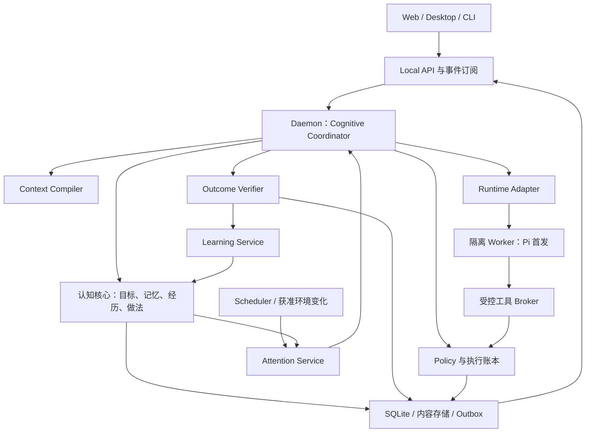

# 系统架构

状态：design-v2 目标；已实现范围见[过渡映射](../planning/design-transition.md)。历史 Runtime/SQLite 合同继续有效，下面不表示服务已经接线。

实施级入口：[详细架构设计](detailed-design.md)。该入口按模块/端口、运行状态机、数据/事务/恢复、API/事件、认知算法、部署六个视图展开本总纲，并映射到已有任务与验收。

## 系统与三条循环

执行循环负责推进用户目标；学习循环评估过去的采用与结果；主动循环判断新的帮助时机。三者共享结构化状态，不能各自维护一份冲突的用户画像或权限。

## 责任边界

| 责任 | 知微 | Runtime |
|---|---|---|
| 长期目标/任务/记忆/权限 | 唯一真源，验证并提交 | 通过工具请求/建议 |
| 单次执行的模型与工具循环 | 提供任务与上下文、约束、停止信号 | 管理推理、工具选择、消息与压缩 |
| 任务拆分 | 协调者保存用户可读工作步骤与完成标准 | 可提出子步骤，不能自行创建无限持久任务 |
| 下一步选择 | task boundary 决策：回答/澄清/读取/执行/等待/终止 | 执行已派发任务内部步骤 |
| 结果判定 | Verifier 对照验收条件形成 Outcome | 提供消息、工具/产物证据，不自证成功 |
| 学习/主动性 | 独立事件驱动服务，有预算与版本 | 受托调用模型提出候选 |
| 能力与配置 | SessionContract 冻结 revision，权限收紧立即生效 | 声明已验证能力与明确 unsupported |

Coordinator 是显式有限状态机与持久任务调度；LLM 是可替换的建议边界，不是确定性内核。不会在每个 Token 或工具事件后再运行一轮“总 Agent”。只在新请求、任务结束、明确纠正、到期信号或需要新授权等边界决策。

## 进程与部署

单用户本地 Daemon 是唯一写入者和调度者；每个活跃执行使用受监督 Worker。UI 不读数据库，Worker 不拥有认知存储。P1 同时最多一个执行 Worker，其他任务持久排队；P4 默认总并发 2、每 Workspace 1，可在验证后配置。学习/主动工作低优先级，不能饿死交互请求。

P1 启动 CLI + loopback Web UI；P4 Electron 启动/监测 Daemon并承载同一界面。崩溃不能把任务改为成功；重启恢复写入状态、核对 leases/outbox，再决定是否可续跑。没有跨进程 exactly-once 承诺，采用持久幂等与外部核对。

## 模块与目录

| 路径 | 正式职责 | 允许依赖 |
|---|---|---|
| packages/domain | 值对象、状态、不变量、决策 DTO | 无仓库依赖 |
| packages/cognition-core | Claim/Goal/Episode/Procedure 的纯状态转换与接受规则 | domain |
| packages/context-compiler | 过滤后材料的确定性选择、预算、渲染与引用 | domain |
| packages/protocol | 本地命令/事件与 Runtime 中立协议校验 | domain |
| packages/memory-store | 事务、Ledger、聚合读写、Outbox、内容生命周期 | domain、protocol |
| packages/pi-adapter | Pi 输入输出规范化、Worker 传输、能力声明 | domain、protocol、Pi |
| apps/daemon | Coordinator、Verifier、Learning、Attention、Policy、API 的显式组合与 I/O 编排 | 上述公开入口 |
| apps/web | 共享产品 UI | protocol DTO，不含后端密钥 |
| apps/desktop | Electron 壳与系统集成 | 共享 UI、本地 API |
| apps/cli | 启动、诊断、开发/恢复命令 | 本地 API |
| packages/evals | 合成场景、基准与跨包验收 | 被测公开入口 |

首版不新增 policy/learning/attention 等空包：纯规则进入 cognition-core，I/O 在 Daemon。只有实际第二消费者或维护边界需要时再按 ADR 拆包。各目录局部 AGENTS 的现行依赖限制保持；实施新边界时机械同步，不用应用层任意导入绕过。

## 技术选择与配置

TypeScript 模块化单体、SQLite WAL、FTS5、事务 Outbox；向量是 P2 的条件索引优化，图只先用关系表。禁止为未经证实需求引入向量服务、图数据库、消息中间件、动态 DI 或插件框架。

技术依据核对于 2026-10-09：[SQLite WAL 官方说明](https://www.sqlite.org/wal.html)、[React 自建应用指南](https://react.dev/learn/build-a-react-app-from-scratch)、[Vite 官方指南](https://vite.dev/guide/)。这些资料支持技术可行性方向，具体锁定版本和本项目兼容性在对应任务验证。

产品配置从 SQLite 的已验证 revision 读取；首次启动参数只给数据根、监听地址和显式凭据入口。层级为内建默认→用户→Workspace→Session，权限取交集，覆写不能放宽安全下界。harness.config.json 只用于仓库治理。

更新配置先验证资源与能力再原子提交；普通模型/工具变化影响新 Session。撤销/权限收紧立即提升 epoch 并阻止后续调用。更换 Runtime 先排空旧任务，不能将 Pi session ID 伪装成新 Provider 的原生会话。

## 故障与恢复

| 故障 | 必须行为 |
|---|---|
| Runtime 不支持所需能力 | 派发前返回 unsupported，UI 给出可执行替代路径 |
| 事件缺口/坏协议 | 隔离该流，标 incomplete，不从最后消息重造“完整历史” |
| 存储失败/磁盘满 | 不确认未提交命令，停止产生依赖持久化的副作用 |
| Worker 丢失 | 保存已知边界，任务进入恢复/核对，不自动无限重启 |
| 模型超时/成本超限 | 一次有界重试或暂停，保留原失败；不换模型静默继续 |
| 派生索引坏/落后 | 从真源重建或明确降级，核心权限过滤不可跳过 |
| 外部动作结果未知 | 进入 NEEDS_RECONCILIATION，禁止盲目重做 |

细化合同见[认知循环](cognitive-loop.md)、[数据接口](data-and-api.md)、[主动与执行](proactivity-and-execution.md)。
