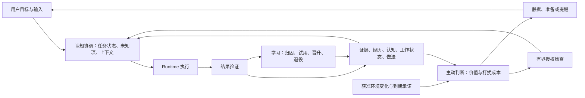

# 知微完整 Agent 设计基线

版本：2026-10-09 / design-v2。工作项：[#94](https://github.com/ntygod/zhiwei-next/issues/94)。本次交付设计与开发合同，不实现产品能力。合并前是待审候选；通过 [ADR 0016](../adr/0016-cognitive-agent-product-baseline.md) 的独立审查并合入后，作为后续开发方向。

## 一句话目标

知微是能够持续理解一个人的目标、在任务中运用记忆、依据结果改进做法，并在合适时机主动提供帮助的本地优先个人 Agent。用户得到的是连续的合作关系、完成的任务和更少的重复解释。

## 已作出的选择

| 设计问题 | 本版决定 | 唯一详细来源 |
|---|---|---|
| 做什么产品 | 完整个人 Agent；首个验证场景是跨日项目协作，涵盖研究、创作与开发，不限定为代码助手 | [产品愿景](../product/product-vision.md) |
| 谁决定下一步 | 知微维护目标、任务、认知状态和受控决策；现成 Runtime 负责单次执行内的模型/工具循环 | [系统架构](../architecture/system-architecture.md) |
| 什么叫记忆 | 证据、经历、认知、工作状态、做法分别建模；假设独立于事实与权限 | [领域模型](../architecture/domain-model.md) |
| 如何使用记忆 | 先隔离/权限/有效性，后检索排序；固定上下文与显式按需读取共存 | [认知循环](../architecture/cognitive-loop.md) |
| 什么叫学习 | 区分展示、采用、结果和收益；从可信结果形成候选做法，经过试用再晋升 | [学习合同](../architecture/learning-and-evaluation.md) |
| 如何主动 | 目标与环境变化驱动；静默、准备、提醒、授权执行分别判断 | [主动与执行](../architecture/proactivity-and-execution.md) |
| 如何授权 | 显式、有界、可撤销的授权；模型与记忆无权扩大权限 | [安全设计](../architecture/trust-and-safety.md) |
| 如何存储和互联 | 单 Daemon 写入、SQLite 与内容存储、事务 Outbox、本地命令与事件订阅 | [数据与接口](../architecture/data-and-api.md) |
| 用户如何操作 | 以项目工作台和对话为主，任务、产物、依据就地展开；首个可用阶段就有界面 | [交互设计](../product/ui-design.md) |
| 怎么开发 | P0—P5 六阶段、每项任务有依赖/验收/失败/回滚；不再等所有记忆层完成后才做产品 | [路线图](roadmap.md)、[开发任务](implementation-plan.md) |
| 怎么证明更好 | 安全不变量 + 跨日任务基准 + 相同模型/预算对照 + 保留集迁移评价 | [验收标准](acceptance-criteria.md) |
| 原成果怎么办 | 保留已验证协议/存储/工具链与有限决议；替代旧阶段顺序，保留历史快照 | [过渡映射](design-transition.md) |

## 设计依据与问题诊断

输入为所有者关于“记忆如何产生智能、学习与主动性”的讨论，以及对完整 Agent、整体重设计和可执行开发计划的明确要求。仓库核对基线为 `main@1872955c8d5fffc7c2477f62343fc38224b4f0da`。当前代码具备规范化 Runtime 协议、Ledger、诊断、工具链及合成实验；没有完整会话产品、记忆闭环或可用桌面应用。

原设计已有 Outcome、Procedure、Attention、纠错、隔离、M2 对照评估和 M3 学习审阅。本版不把这些误报为缺失；主要问题是它们之间的运行责任、数据合同和交付顺序没有收敛：

1. Claim 中心的链路不足以表达“现在在做什么、哪里不确定、为什么下一步这样做”。补 Goal/Task/WorkingState/Episode/Hypothesis 与受控认知决策。
2. 提取与治理不自动带来智能。为每轮建立目标、选择、使用、结果、反馈的可追踪关系，并规定不确定时如何停止、验证或询问。
3. 访问频次与任务成功不足以证明经验有效。增加实际采用与收益证据，禁止把所有注入记忆一起记功。
4. 主动性需要判断是否值得打扰和是否应先准备，而非只有触发器。以目标/承诺/环境差异、负担和授权共同决定。
5. 作用域、隐私与来源信任需要正交。原 `private` scope 可以关联 workspace，但仍把不同维度混在同一分类中；新合同显式分开。
6. 原 M0→M7 严格顺序让用户体验验证过晚。采用每阶段可运行的纵向产品切片；基础安全前置仍按能力保留。

## 三条循环，共用一份认知状态

知微不实现第二套通用 Agent Loop，不让一组自由运行的“思考 Agent”互相聊天维持状态。三条循环由持久任务、事件和有预算的决策步骤驱动；模型只提出结构化建议，核心负责合法状态转换。

## 阅读与开发入口

后续 AI/人先读本页、[当前交接](next-task-handoff.md)与相应任务卡，再进入该任务引用的合同。不要把所有文档都复制进 Prompt。设计问题以 ADR 为准，实施状态以 Issue/PR/代码/场景证据为准。旧工作包数字、实验通过数、文档审查通过都不能代替产品阶段验收。

已经定案的是产品行为、责任边界、协议语义、默认策略和开发顺序。性能阈值与学习晋升参数是明确的首版工程目标，需要用规定实验验证；测量不达标时修改实现或另立 ADR 调整承诺，不能把猜测写成实测结果。任何未来 Provider 的兼容性都必须单独证明。
